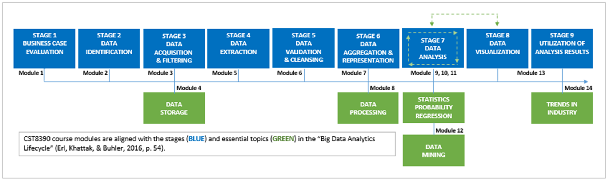
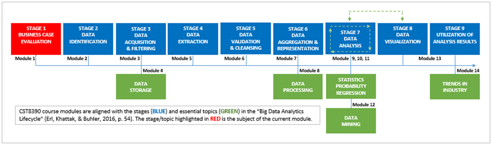

# Module 1: Introduction to Business Intelligence and Data Analytics

## Introduction

This module introduces the **value proposition of Business Intelligence and Data Analytics (BIDA)**, focusing on **stage one of the Big Data Analytics Lifecycle: Business Case Evaluation**. Learners will examine the **costs, benefits, and justification for BIDA investments**, and learn how to **create and pitch a BIDA proposal**.

#### Key Learning Components:
- Understand the **Big Data Analytics Lifecycle** (Erl et al., 2016).
- Define and explain **Business Intelligence and Data Analytics (BIDA)**.
- Identify the **importance of data visualization** in BIDA.
- Perform a **basic data visualization task** using raw data.
- Understand and apply **ROI (Return on Investment)** and **TTV (Time to Value)**.
- Identify and describe the **components of a business case**.
- Explore the **project management triangle** (quality, schedule, budget) and its impact on BIDA.
- Learn to **design and pitch a BIDA proposal** to decision makers.
- Navigate the **Weka Explorer** tool.

#### Key Terms:
- **BIDA** – Business Intelligence and Data Analytics.
- **Business Case** – A verbal or written statement of benefits and costs associated with a project.
- **Project Management Triangle** – The three primary constraints in project management: quality, schedule, and budget.
- **Return on Investment (ROI)** – The financial gain from an investment relative to its cost.
- **Time to Value (TTV)** – The duration required to realize the benefits of a solution.
- **Visualization** – The presentation of data analysis results in graphical or visual formats.

#### Required Readings:
- Erl, T., Khattak, W., & Buhler, P. (2016). *Big Data Fundamentals: Concepts, Drivers and Techniques*. Prentice Hall.
  - Chapter 1: Understanding Big Data
  - Chapter 3: Big Data Adoption and Planning Considerations (pp. 54–70)

By the end of this module, students will be able to assess the value of a BIDA program and determine if the investment is justified.

## The Lascaux Code – Data Visualization Across Time

The famous **Lascaux cave paintings** in southwestern France (c. 17,000–15,000 BCE) are widely admired for their artistic brilliance, especially in conveying **depth, motion, and perspective**. But from a **business intelligence and data analytics (BIDA)** perspective, their true genius lies elsewhere.

The paintings reflect **time series data**—depicting animals in a sequence aligned with their **breeding seasons**. This suggests:
- A **visual representation of temporal patterns**.
- The ability to **predict future behavior** based on past observations.
- Remarkable **data persistence**, with insights surviving millennia—contrast to today’s fleeting data.

Our Paleolithic ancestors, unknowingly, engaged in the earliest forms of **data analysis and visualization** to support survival and planning.

---

### Learning Activity 1: A Definition of Business Intelligence

**Scenario**: Imagine living in a prehistoric cave with only rocks, fire, and spears. Your tribe survives by tracking and analyzing animal behaviors over generations. You summarize these insights visually on cave walls.

**Question**: How do you define business intelligence?

**Correct Answer**:
> **Use data from yesterday and today to make better decisions about tomorrow.**

**Insight**:
Although data visualization comes at the **final stage of the analytics lifecycle**, the **impactful presentation of data** is central to the entire analytic process—beginning with identifying the question and the message.

---

### Learning Activity 2: Simulation – BIDA Penguin Migration

You’ve tracked the **monthly population of BIDA penguins** at the College from **2015 to 2019**.

#### Task:
Create a **visual representation** (e.g., graph, chart, sketch) of the penguin **migratory trends** using the provided data. Your medium can be digital, analog, or even symbolic (e.g., cave-style illustration).

#### Interpretation (Example Summary for CWCA):
> "The BIDA penguin population showed consistent seasonal fluctuations from 2015 to 2018, followed by anomalous uniform counts in 2019—suggesting either data collection issues or major ecological changes."

### BIDA Penguin Migration Data (Monthly Counts)

| Year |  Jan | Feb | Mar | Apr | May | Jun | Jul | Aug | Sep | Oct | Nov | Dec |
|------|------|-----|-----|-----|-----|-----|-----|-----|-----|-----|-----|-----|
| 2015 |  762 | 461 | 374 | 521 | 712 | 274 | 384 | 492 | 561 | 821 | 930 | 1014 |
| 2016 |  779 | 478 | 391 | 543 | 910 | 287 | 399 | 511 | 584 | 843 | 951 | 1028 |
| 2017 |  793 | 491 | 407 | 559 | 755 | 304 | 418 | 536 | 601 | 862 | 973 | 1058 |
| 2018 |  587 | 281 | 210 | 349 | 561 | 123 | 225 | 304 | 416 | 642 | 769 |  853 |
| 2019 |  572 | 572 | 572 | 572 | 572 | 572 | 572 | 572 | 572 | 572 | 572 |  572 |

---

### Key Concepts Reinforced:
- **Data visualization** is both ancient and essential.
- BIDA helps **make sense of patterns** in complex systems.
- Effective analytics connects the **past**, **present**, and **future** for **better decision-making**.

## Big Data Analytics Lifecycle (Summary)

Based on Erl, Khattak, and Buhler (2016), the **Big Data Analytics Lifecycle** consists of nine stages that guide the transformation of raw data into actionable insights:

1. **Business Case Evaluation**  
   Define the purpose, benefits, and expected outcomes of the analytics initiative.

2. **Data Identification**  
   Select the relevant data and determine its sources.

3. **Data Acquisition and Filtering**  
   Gather the required data and remove corrupt or irrelevant entries.

4. **Data Extraction**  
   Extract and transform data into formats suitable for analysis.

5. **Data Validation and Cleansing**  
   Ensure data quality by removing invalid entries and addressing missing values.

6. **Data Aggregation and Representation**  
   Consolidate and organize data into a unified, meaningful format.

7. **Data Analysis**  
   Apply analytical or statistical methods to discover patterns, anomalies, or models.

8. **Data Visualization**  
   Present the results in visual formats (e.g., charts, dashboards) for decision-makers.

9. **Utilization of Analysis Results**  
   Use insights to support and improve business processes and outcomes.

This lifecycle provides a structured, repeatable approach to executing effective data analytics projects.

## Stage 1: Business Case Evaluation

All businesses—whether for-profit or not-for-profit—must ensure that their operations provide **business value**. Business cases articulate this value by weighing **benefits** against **costs**, and serve as the foundation for investing in new initiatives like Business Intelligence and Data Analytics (BIDA).

---

### BIDA: Business Intelligence and Data Analytics

Though conceptually distinct, **business intelligence** and **data analytics** are treated as a unified process (BIDA) because of their interdependent, mutually beneficial nature.

---

### Benefits of BIDA

BIDA supports **rational, data-driven decision-making** by adhering to four guiding principles:

- **Accuracy**:  
  Data must be objective and error-free to avoid flawed insights and poor decisions.

- **High Value**:  
  Insights must go beyond the obvious, revealing hidden or previously unknown patterns.

- **Timely**:  
  Data must be current, and insights must be delivered quickly enough to support informed decision-making.

- **Actionable**:  
  Insights should directly impact tangible outcomes (e.g., profit) or intangible outcomes (e.g., employee morale).

**Failure to meet any of these principles can compromise the success of a BIDA initiative.**

---

### Example Case

A telecom company faced delays in understanding customer churn due to outdated reporting processes. A new BIDA platform was proposed to let business users generate reports on demand, reducing wait times from **months to minutes** and helping **retain customers and revenue**.

---

### Costs of BIDA

BIDA initiatives come with varying costs based on:

- **Scope**:  
  Departmental (lower cost) vs. enterprise-wide (higher cost) implementations.

- **Technology Gap**:  
  The difference between current capabilities and future needs, including upgrades and hiring/training.

- **Total Cost of Ownership (TCO)**:  
  Includes licensing, maintenance, operations, and long-term support.

---

### Payoff Considerations

Two key metrics help determine value:

- **Return on Investment (ROI)**:  
  Compares financial gains to costs.

- **Time to Value (TTV)**:  
  Measures how long it takes to realize the benefits, not considering cost.

📌 **Important Note**: Attempting to **maximize ROI** and **minimize TTV** simultaneously may sacrifice quality—violating the principles of the **project management triangle** (quality, schedule, budget). Businesses must prioritize which aspects matter most.

---

### Conclusion

A well-crafted business case for BIDA must:
- Clearly show how it aligns with the four guiding principles
- Balance scope, cost, and quality expectations
- Present alternative scenarios with ROI and TTV estimates

## BIDA Wizard’s Elevator Pitch

**Problem Statement:**  
"We're currently unable to retain customers effectively because we lack timely, accurate analytics and can’t easily identify churn patterns."

**Baseline Value ($):**  
"This limitation is costing us approximately **$4.2 million annually** in lost revenue from preventable customer churn."

**Addressable Scope (%):**  
"While some churn is inevitable, we estimate that **60%** of this loss is addressable with better analytics."

**Solution Enabler:**  
"By implementing an enhanced analytics platform, we'll centralize data, surface trends in real time, and empower business users to respond proactively."

**Improvement Range (%):**  
"We anticipate a **25–35% reduction in churn-related losses**, directly attributable to improved business intelligence and data access."

## BIDA Definition

You’ve made your pitch and your boss wants to hear more. Before she/he walks out of the elevator, she/he asks,  
**“Remind me, what is business intelligence and data analytics?”**

### Learning Activity 4: BIDA Definition

You are a BIDA wizard and your boss has requested a definition of BIDA. Given the alternatives below, which is the most correct response?

a) BIDA is any activity, tool, or process used to obtain the best information to support the process of making decisions.  
b) BIDA is putting computing power to work to help make the best choices for the organization.  
c) BIDA is using data from yesterday and today to make better decisions about tomorrow.  
d) All the above.  
e) None of the above.

### Correct Response

The correct response is **d) All the above**.  
Answers “a,” “b,” and “c” are all technically correct, so answer “d” is also correct.  
Answer “e” is correct in that BIDA practitioners (vendors, consultants, academics) often have their own preferred definitions.

## Weka Work

### Learning Activity 6: Download Weka

Click the link below to download Weka, if you have not already done so.  
**Download Here:** [https://sourceforge.net/projects/weka/](https://sourceforge.net/projects/weka/)

WEKA is free software, licensed under the GNU General Public License, which contains tools and algorithms for data analysis and data visualization through a graphical user interface (GUI).

Please note the following:  
- Example datasets are included when you download Weka.  
- You will find them in your Weka program folder, inside the `data` folder.  
- These datasets are in the ARFF format used by Weka.  
- When presenters in videos refer to “loading a dataset into Weka,” they may be referring to one of these included datasets.

