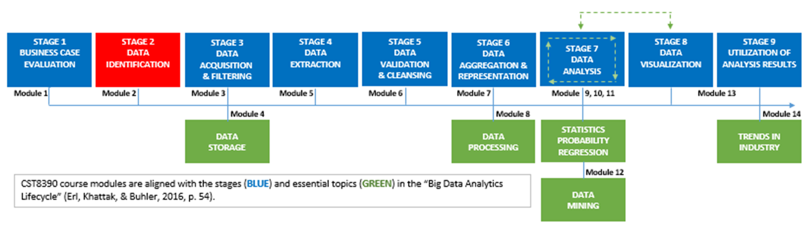
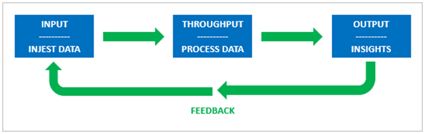
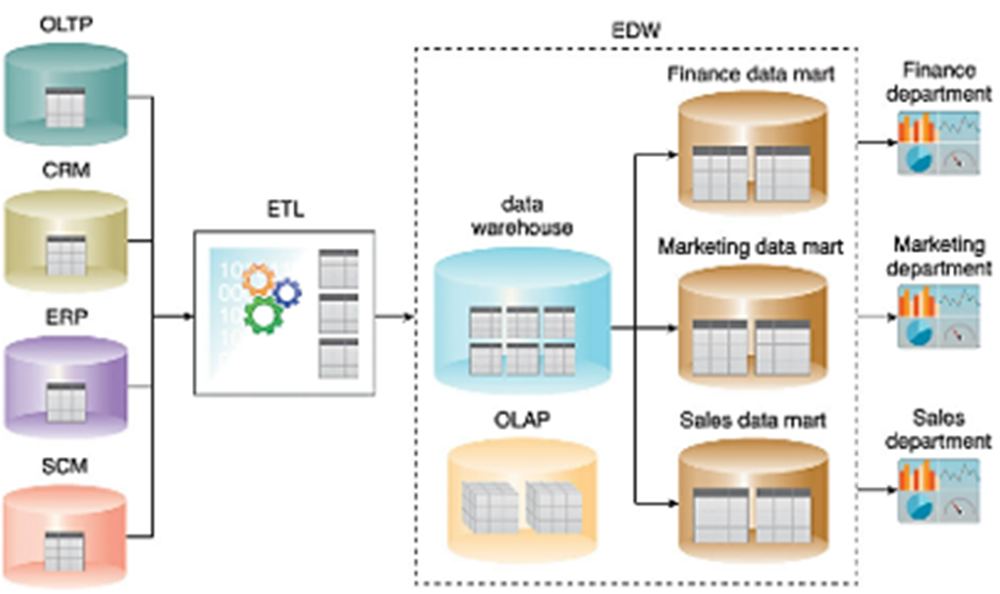
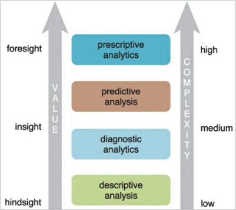

# Module 2: Data Identification

# Introduction

> Not everything that can be counted counts, and not everything that counts can be counted.  
> — Albert Einstein, Physicist

In module one you acquired understandings of the definition of business intelligence and data analytics (BIDA), the stages in the *Big Data Analytics Lifecycle* (Erl, Khattak, & Buhler, 2016, p. 54), and stage one of the lifecycle, “Business Case Evaluation.” 

In this module, you will build on those understandings by studying a traditional BIDA architecture and by learning more about data and the types of analytics used to draw insights from them. You will also add to your knowledge of the data analytics lifecycle by exploring stage two, “Data Identification” (please see the diagram, below) and begin to appreciate how, in some cases, stages in the lifecycle align with components of a BIDA architecture.

By the end of the module, you will be able to decide for yourself if the eminent Mr. Einstein was on to something when it comes to the importance of selecting and, within the bounds of privacy laws, finding the correct data.

> *“Big Data Analytics Lifecycle” (Erl, Khattak, & Buhler, 2016, p. 54).*

---

## Learning Outcomes

By the end of this module, you should be able to complete the following:

- Explain how a business intelligence and data analytics decision support capability helps address business problems.
- Identify the components of a traditional business intelligence and data analytics architecture.
- Identify transactional databases (Online Transactional Processing [OLTP]) and relational databases.
- Describe Online Analytical Processing (OLAP).
- Define descriptive, diagnostic, predictive, and prescriptive analytics.
- Explain the benefits and risks of building a business intelligence and data analytics decision support capability.
- Explain “Data Identification,” stage 2 of the big data analytics lifecycle.
- Define “Big Data” and name its sources.
- Identify and explain the “Five Vs” of big data.
- Interpret the nature of unstructured, semi-structured, and structured data.
- Explain financial, customer focused, and employee-centered Key Performance Indicators (KPI).
- Generate descriptive statistics using Microsoft Excel.
- Create a file in the ARFF format used by WEKA.

---

## Key Terms and Concepts

**Big Data**  
Data volumes that exceed the capacity of traditional data processing software and relational databases.

**Data Mart**  
Subsets of data warehouses that contain data specific to a unit within an organization, such as the sales department.

**Data Warehouse**  
Repositories where data is validated, aggregated, and stored for analysis.

**ETL**  
Extract, transform, load (ETL) tools copy data from one or more sources into another system in a format that is different from the original source.

**KPI**  
Key performance indicators are measures that show the outcomes of processes that contribute to the overall success of a company.

**OLAP**  
Online Analytical Processing tools work with multi-dimensional numeric data and facilitate fully interactive sessions between users and the OLAP software itself.

**OLTP**  
Online Transaction Processing tools focus on transaction-oriented tasks, such as order entry and point of sale transactions.

**Relational Databases**  
Databases that store data points, the relationships between which are established at the intersections of the database’s rows and columns.

## A BIDA Mousetrap

Welcome to the end of another hard week as the company’s BIDA wizard. You’re waiting for the elevator and, on its way down from the ivory tower, it stops at your floor.

The doors open and you find yourself staring into the face of your boss, who, last time you met, approved your pitch to implement a new BIDA system.

Since then, the costs of the project have been piling up, but the company has seen no value in return. You know that the next fifteen seconds are going to feel like an eternity, and they begin when the doors close.

> **Boss:** “How’s this BIDA stuff work again?”  
> *(Suspicion, scepticism, and hostility competing for space in a voice that sounds like a cement mixer.)*

**You:**  
“Think of it as an open system (insert the title you think is most appropriate — *Sir, Ma’am, Your Highness*),”

> “It takes inputs — data. Throughputs it — analyzes it. Then produces outputs — insights about the company.”

### System view of Business Intelligence and Data Analytics

> **Boss:** “Oh, yeah? Tell me, again, how that’s gonna help me… I mean, help the company?”

**You:**  
“Well, (insert the title you think is most appropriate — *Sir, Ma’am, Your Highness*),” you reply, as the elevator doors crack open.  
“It will make you… I mean the company… look good. Whenever you want to, you’ll be able to check the pulse of the company. If things aren’t going to plan, then straight away you’ll be able to tell us what we need to do to fix it. So, you’ll have a net positive impact on the company’s bottom line. Our shareholders will be thrilled.”

> **Boss:**  
> *Hmmm…* (mulls over your answer for a heartbeat, then smiles and swaggers out of the elevator car)  
> “Sounds good to me! Great work, Wiz!”

Grateful for the ride to be finished and the weekend to be starting, you sigh,  
**“B.I.D.A!”**

## BIDA Architecture Overview (The Grand Design)

**BIDA (Business Intelligence and Data Analytics)** uses technology to answer key business questions. While each organization’s needs vary, BIDA architectures follow a common lifecycle and consist of two main parts: **Back End** and **Front End**.

---

### Back End

- **Data Sources** (internal/external):
  - **Transactional Databases (OLTP)** – Real-time data processing (e.g., sales, transactions).
  - **Relational Databases** – Store linked business data (e.g., CRM, ERP, SCM).

- **ETL Tools** – Extract, Transform, Load data from sources into another system.

- **Enterprise Data Warehouse (EDW)** – Central repository for analysis:
  - **OLAP (Online Analytical Processing)** – Multidimensional data cubes for analysis.
  - **Data Marts** – Focused data subsets (e.g., by department).

---

### Front End

- **Analytics Tools** – Support four levels of analysis:
  - **Descriptive** – What happened?
  - **Diagnostic** – Why did it happen?
  - **Predictive** – What will happen?
  - **Prescriptive** – What should we do?

- **Visualization** – Dashboards and reports to support decision-making.

- **Feedback Loop** – Insights lead to actions, which generate new data, feeding back into the system.

## BIDA Benefits, Risks, and Common Sense

### 🚀 Benefits of BIDA

- Data-driven decisions replace guesswork.
- Better decision-making efficiency and effectiveness.
- Optimized business processes.
- Boosted employee morale.
- Increased visibility into market trends.
- Discovery of new revenue opportunities.
- Competitive advantage and market share growth.
- Improved ability to meet/exceed business goals.

---

### ⚠️ Risks of BIDA

- **GIGO**: Garbage In, Garbage Out — bad data = bad insights.
- Application bugs and performance issues.
- Integration difficulties with existing systems.
- User resistance or lack of adoption.
- Budget overruns or unforeseen costs.
- Tech aging (e.g., needing upgrades, tuning, replacements).

---

### 🧙 Wizardly Risk Control

To choose the best BIDA solution:

1. Define the problem.
2. Compare **value**, **risk**, and **ease of delivery**.
3. Use a comparison matrix to justify your recommendation.
4. Start with the **least risky, easiest to deliver** option.

---

### 🔁 Post-Implementation Best Practice

> **Correct Next Step**:  
**Review outcomes**, refine your solution and process.  
**(Not** set it and forget it, restart from scratch, or halt future investment**)**.

BIDA is an **open system** — it evolves through continuous feedback and improvement.

## Stage 2: Data Identification

Enter into your preferred search engine a query related to data production rates and you will be returned a host of estimates. The estimates will range from the amount generated per person, per second, up to the amount generated on an annual basis, globally. They suggest, ultimately, that data in quantities measured in **zettabytes**, the equivalent of **trillions of gigabytes**, is generated, stored and, in theory, available for analysis.

Data in volumes as large as those estimated, that exceed the capacity of traditional data processing software and relational databases, are referred to as **“Big Data.”** To be processed effectively and efficiently, big data demand **BIDA architectures** of the type discussed earlier in this module. BIDA architectures are engineered to address the **“Five Vs”** that characterize big data:

- **Volume**  
- **Velocity**  
- **Variety**  
- **Veracity**  
- **Value**  
*(Erl, Khattak, & Buhler, 2016, p. 13)*

---

### Volume

Estimates of data production highlighted earlier in this discussion are subject to revision, as it is anticipated the volume of data production will continue to increase. Data volume drivers include **e-commerce, e-business, social media, and the Internet of Everything (IoE).**

---

### Velocity

Velocity refers to the **speeds at which data are processed** by your BIDA system.

---

### Variety

Variety refers to the **sources (internal or external), nature (qualitative or quantitative), and types of data** (structured, semi-structured, unstructured, or metadata).

#### Source:

- **Internal:** Data retrieved from inside the company (e.g., sales, finance, marketing, HR).  
- **External:** Data collected outside the organization (e.g., surveys, questionnaires, research, customer feedback).

#### Nature:

- **Qualitative:** Also called **categorical data**, these are non-numerical, based on the senses.  
- **Quantitative:** Measurable or countable data, expressed as numbers.

#### Type:

- **Structured:** Generated by enterprise applications (ERP, CRM); stored in relational databases.  
- **Semi-structured:** RSS feeds, spreadsheets with hierarchical structure.  
- **Unstructured:** Text (tweets, blogs), binary (media files); do not conform to a data schema.  
- **Metadata:** "Data about data" — can be descriptive, structural, administrative, reference, or statistical.

##### Metadata Types:

- **Descriptive:** Used for identification (e.g., title, abstract, author, keywords).  
- **Structural:** Describes characteristics of digital materials (e.g., types, versions, relationships).  
- **Administrative:** Used to manage data (e.g., provenance — when/how it was processed).  
- **Reference:** Describes contents and quality of statistical data.  
- **Statistical:** Describes processes that collect or produce statistical data.

---

### Veracity

Veracity refers to the **quality of data**, determined by:

- **Noise:** Data that cannot be converted into useful information (targeted for removal).  
- **Signal:** Data that can be converted into meaningful information.

> Signal-to-noise ratios drive the magnitude of processing required to remove invalid (noise) data.

---

### Value

Value refers to the **usefulness of data** in the analytics process. It is influenced by:

- **Veracity** (low noise = higher value)  
- **Timeliness** (quick processing = higher value)

---

### Learning Activity 5: Explore Open Data Sources

Open data can be **accessed, modified, reused, and shared** by anyone.

🔗 **[Go to this website](https://researchguides.library.wisc.edu/statistics/opendata)** for an overview of, and links to, 15 open data sources anyone can use.

---

### Data, BIDA, and Business KPIs

There is a relationship between:

- **Data and BIDA Architecture:** The architecture must address the "Five Vs".
- **Data and Business:** The BIDA process must produce **actionable insights** that positively impact performance.

#### Key Performance Indicators (KPIs)

KPIs are **performance measures** tied to the company’s **Critical Success Factors (CSFs)** and **goals/objectives**. They help in data selection for BIDA systems and can be grouped into:

##### 1. Financial KPIs

- Revenue growth rate  
- Net profit  
- Return on investment

> Drive financial position but may stifle innovation if overemphasized.

##### 2. Customer-Focused KPIs

- Conversion rate  
- Customer retention

> Drive product/marketing innovation and support, potentially at the expense of profit.

##### 3. Employee-Centered KPIs

- Employee engagement  
- Satisfaction  
- Turnover

> Drive employee satisfaction, innovation, and customer satisfaction.

> **The mix of KPIs determines the data inputs and outputs** of your BIDA system.

---

### Learning Activity 6: View Video Clip

🎥 **[Watch this video](https://www.youtube.com/watch?v=6x0s9qF7E_0)**:  
**"Introduction to Business Analytics"** (22:30)  
It provides an overview of business analytics and how data-driven decisions are made.

## Summary

Having tested Einstein’s theory – not the one about space and time being interwoven into a single continuum called space-time – you conclude that **quantitative data** and **qualitative data** each have their place in the world of **business intelligence and data analytics (BIDA).**

Your first step toward this enlightened state came when you discovered that **entanglements exist between BIDA architectures and the BIDA lifecycle.** This reality hit you squarely when you realized that the **back end of BIDA architectures** is where the **data stores and datasets** reside — the very ones you must scour in **Stage 2: Data Identification** of the lifecycle.

Initially, you thought this stage would be trivial. After all, you *know* what data you want, right?

Then you saw the **volume** and **varieties** of data being generated every second, and you realized that identifying the data required to answer the questions posed by the **Conflagration of BIDA Wizards** could be overwhelming — *were it not for* the **Key Performance Indicators (KPIs)** your boss uses to position themselves for their annual bonus — scratch that — *KPIs that measure company success.*

You came to understand that KPIs come in a variety of **flavors**, including:

- **Financial KPIs**
- **Customer-focused KPIs**
- **Employee-centered KPIs**

Achieving a **balance** between the three is one of the keys to ensuring:

- Financial stability  
- Customer satisfaction  
- Employee happiness

---

And what types of data do you use to analyze KPIs?

Why, none other than a mix of those that **Einstein identified** as:

> **The types you can count**  
> *and*  
> **The types you can’t count.**
