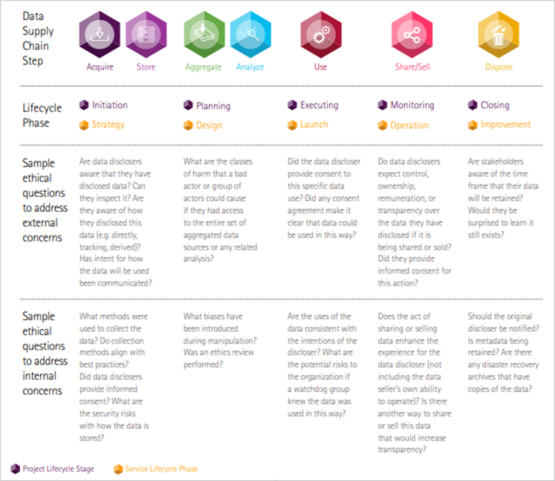
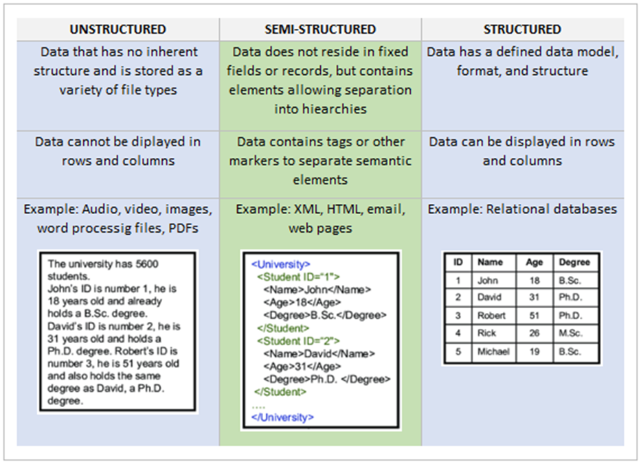

# 📊 Module 3: Data Acquisition and Filtering

> *"With data collection, 'the sooner the better' is always the best answer."*  
> — Marissa Mayer, IT Executive

---

## 🧭 Module Overview

You're now moving into **Stage 3** of the Data Analytics Lifecycle:  
➡️ **Data Acquisition and Filtering**

Unlike the earlier stages — building the business case (Stage 1) and identifying data sources (Stage 2) — this phase is **hands-on and intrusive**. You’re now collecting specific data (your “needles in the haystack”) and ensuring that this is done **ethically** and in line with **data privacy regulations**.

---

### 🎯 Learning Outcomes

By the end of this module, you should be able to:

- ✅ Explain the concept of the **data economy**.
- ✅ Recognize and articulate **data ethics** principles.
- ✅ Describe how **ethics** and **privacy laws** apply to the analytics lifecycle.
- ✅ Define and explain **data acquisition**.
- ✅ List the steps and challenges in the **data acquisition process**.
- ✅ Define and apply **data filtering**.
- ✅ Use **Microsoft Excel** to import and filter data from a web page.
- ✅ Understand Weka concepts: **concept**, **instance**, and **attribute**.
- ✅ Load, classify (with J48), and visualize a dataset in **Weka**.
- ✅ Import **structured web data** into Excel.

---

### 🗝️ Key Terms and Concepts

| Term | Definition |
|------|------------|
| **Data Acquisition** | Gathering data from distributed information sources. |
| **Data Economy** | The global digital ecosystem where data is collected and monetized for value creation. |
| **Data Ethics** | Systematic principles around right and wrong conduct involving data, especially personal data. |
| **Data Filtering** | Selecting a smaller, relevant subset of your data for analysis. |

---

## 🏜️ The Data Frontier

Just like the mythic Wild West, today’s data economy pits powerful “data barons” against users whose personal information fuels their profits. But unlike the old West, modern “data sheriffs” — in the form of privacy regulations — are stepping in to protect your rights. As data flows faster than ever, it pays to be privacy-aware before letting your data roam free.

## 🤠 The Code

Cowboys of fiction lived by the unwritten Code of the West — values and behaviors for survival on the frontier. Owen (2015) adapted this idea for modern business ethics, offering a guide to navigating the rigours of today’s digital landscape.

A **code of ethics** is a framework for behavior, decision-making, and defining right from wrong. It reflects personal or institutional values, such as honesty and respect, and helps communicate what matters to you — and why.

In the **data economy**, where vast amounts of information are monetized, **data ethics** provide essential guidelines. Data ethics involve systemizing, defending, and recommending moral conduct related to data — especially personal data.

> "Data ethics is about doing the right thing for people and society."  
> — *DataEthics, 2018*

### 📜 Five Principles of Data Ethics (DataEthics, 2018)

1. **The human being at the centre**  
   Human interests take priority over institutional and commercial gains.

2. **Individual data control**  
   People should control and be empowered by their data.

3. **Transparency**  
   Data processes and decisions must be understandable and explainable to individuals.

4. **Accountability**  
   Organizations must use and protect personal data responsibly and systematically.

5. **Equality**  
   Data practices must be sensitive to existing power imbalances and avoid harming vulnerable groups.

### 🔍 Applying Ethics to Data Acquisition

Ethics-based questions can be asked at every stage of the analytics lifecycle. At **Stage 3: Data Acquisition and Filtering**, questions might include:

**External Concerns (Data Disclosers):**
- Are individuals aware that they have disclosed data?
- Can they view or inspect what was collected?
- Do they understand how the data were collected (e.g., directly vs. tracking)?
- Was the intended use of the data communicated?

**Internal Concerns (Data Processors):**
- Were best practices followed in data collection?
- Did individuals provide informed consent?
- What security risks exist in data storage?

These aren’t life-or-death dilemmas, but they’re crucial to ensuring digital trust and mitigating the risks of profiling, discrimination, and systemic injustice in analytics.

## Do What Has To Be Done

- People often see themselves differently from how others perceive them.
- The phrase “perception is reality” suggests that how others view you (or your business) shapes your identity in their eyes.
- This applies to businesses: favorable perceptions (e.g., ethical, compliant) support success; unfavorable ones can damage brand image.
- Traits like regulatory compliance influence how companies are labelled (e.g., “blue chip” vs. “blacklisted”).
- Perceptions aren’t always accurate, but they are real to those who hold them.
- Formal regulations (e.g., GDPR) help verify or disprove perceptions through objective evaluation.
- Compliance with data privacy laws builds trust and reflects ethical values.
- GDPR emphasizes lawful, fair, and transparent data use; violations result in serious penalties.
- Aligning external perception with operational reality is vital to safeguard brand and business success.

## Stage 3: Data Acquisition and Filtering

- Marks the beginning of the more intrusive phase of the data analytics lifecycle.
- Involves actively collecting and pulling data from internal and external sources.
- Requires careful consideration of ethical and legal issues surrounding data acquisition.
- Tied to the "Five Vs" of Big Data: Volume, Velocity, Variety, Veracity, and Value.
- Focus on “Variety” — types of data include:
  - Structured data
  - Semi-structured data
  - Unstructured data

### Data Acquisition

- Defined as gathering data from distributed sources for storage and analysis.
- May involve:
  - Collecting new data
  - Converting legacy data
  - Sharing/exchanging data
  - Purchasing data
- Key steps include:
  - Establishing data interfaces and feeds
  - Using tools such as:
    - **Storm** (real-time data streams)
    - **Flume** (log data collection)
    - **Hadoop** (scalable distributed computing)
  - Integrating data via APIs
  - Storing raw data in a master dataset
  - Connecting raw data with the analytics pipeline

#### Challenges

- Tools must handle:
  - High-velocity and real-time data
  - Diverse sources and structures (e.g., social media, sensors, logs)
  - High event rates (tens to hundreds of thousands per second)
- Goal: Maintain high throughput without losing data

### Data Filtering

- Involves selecting a subset of the data for analysis.
- Removes:
  - Corrupt data (e.g., missing, nonsensical, or invalid types)
  - Data deemed irrelevant to the current analysis
- Important practice:
  - Store a **verbatim, compressed copy** of the original data set
  - Filtered-out data may still be useful for future analysis

### Media and Entertainment Sector (Example Use Case)

- Sector faces challenges with managing and sharing large volumes of media and metadata.
- Common tools and solutions:
  - High-performance file systems
  - Digital archiving technologies
  - Clients supporting shared content pools across applications
  - Specialized storage for performance, cost, and retention
- Streaming and digital content consumption trends:
  - Growth of on-demand and personalized content
  - Increased broadband penetration supports streaming
  - Control shifts to consumers (choose what/when to watch/listen)
- Data Privacy Considerations:
  - Media firms hold large volumes of personal data
  - Responsible for data protection and ensuring cloud providers comply
  - Data breaches (e.g., Sony, LinkedIn) have had serious financial and reputational consequences

### References

- Lyko, K., Nitzschke, M., Ngonga, Ngomo A.C. (2016). *Big Data Acquisition*. In: Cavanillas, J., Curry, E., Wahlster W. (eds) New Horizons for a Data-Driven Economy. Springer, Cham.
- Erl, T., Khattak, W., & Buhler, P. (2016). *Big Data Fundamentals: Concepts, Drivers & Techniques*. Pearson Education.
