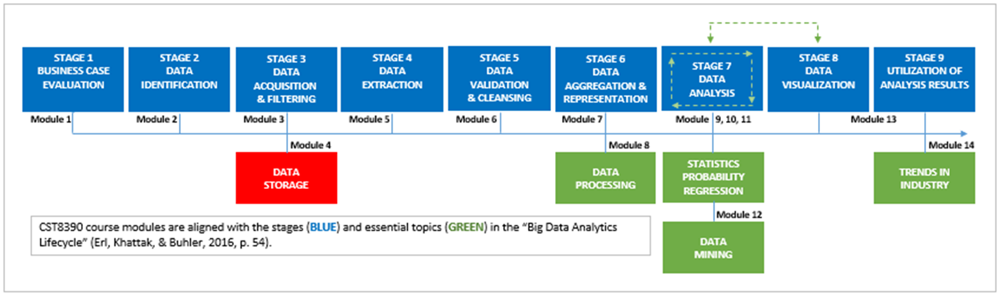
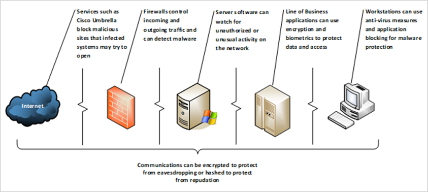
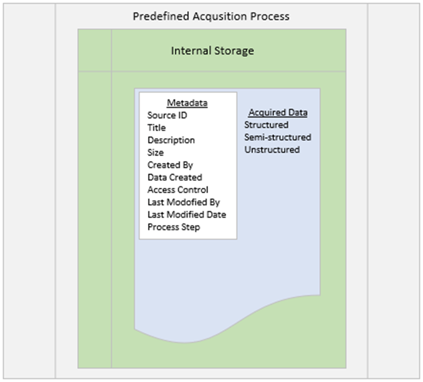
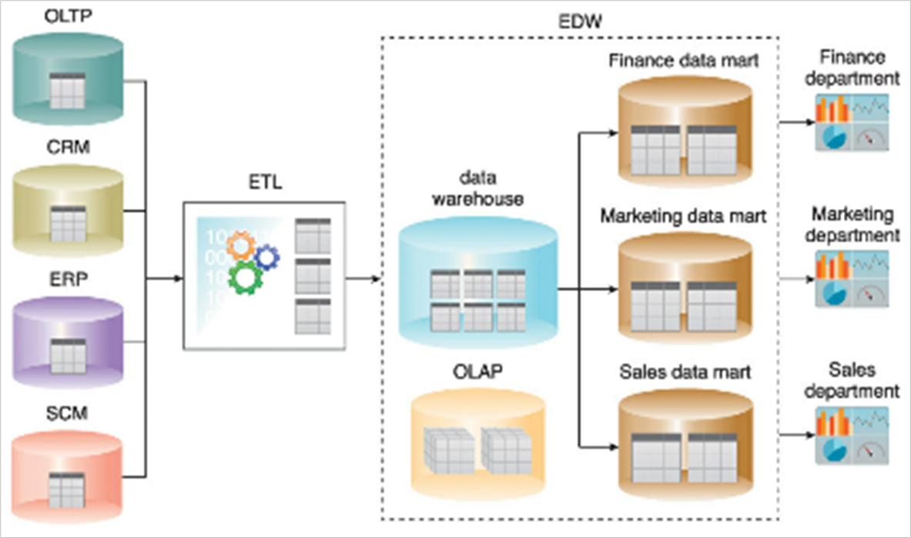
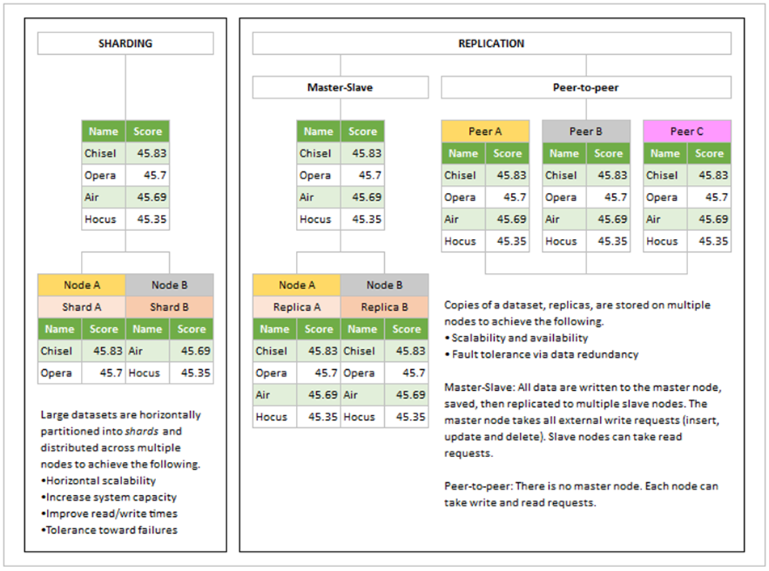
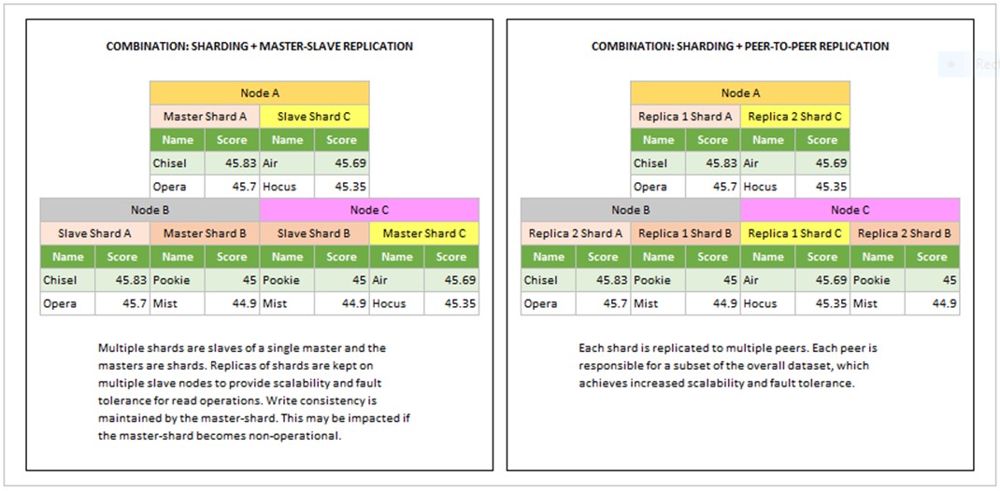

# Module 4: Data Storage

## Introduction  
> *Data is a precious thing and will last longer than the systems themselves.*  
> — Tim Berners-Lee, inventor of the World Wide Web

Having completed the previous module, you understand the ethics and mechanics of data acquisition. Now, as you prepare to analyze your data, it’s important to consider data protection and storage strategies to safeguard your valuable assets from threats and to handle the growing flood of data efficiently.

---

### Learning Outcomes

By the end of this module, you should be able to:

- Explain the differences between **data privacy** and **data protection**.
- Describe two approaches to data protection: **defense-in-depth** and **data security platform**.
- Explain what is meant by **data provenance** and discuss its importance.
- Identify the components of a **data warehouse architecture**.
- Explain big data storage principles, including **CAP Theorem**, **ACID**, and **BASE**.
- Interpret big data storage techniques, including **sharding** and **replication**.
- Describe big data storage technologies, including **on-disk storage** and **in-memory storage**.
- Implement the abilities to **edit, filter, and visualize datasets in Weka**.
- Implement the abilities to **import data from a web page**, then filter it using **text functions and database functions in Microsoft Excel**.

---

### Key Terms and Concepts

- **ACID**  
  Database transaction management that focuses on consistency.

- **BASE**  
  Database transaction management that tolerates inconsistency.

- **CAP theorem**  
  A principle which holds that a distributed database system running on a cluster can at one time achieve two, but not all three of the constraints: consistency, availability, and partition tolerance.

- **Clusters**  
  Tightly coupled collections of networked nodes (servers) that work as a single unit.

- **NoSQL**  
  A type of on-disk storage designed to host structured and semi-structured data.

- **Replication**  
  Copying datasets and storing the copies on multiple nodes.

- **Sharding**  
  Partitioning datasets horizontally and distributing the shards across multiple nodes.

---

### Readings

**Textbook:**  
Erl, T., Khattak, W., & Buhler, P. (2016). *Big data fundamentals: Concepts, drivers and techniques.* Prentice Hall.

- Chapter 5: Big Data Storage Concepts.  
- Chapter 7: Big Data Storage Technology.

---

## Privacy ≠ Protection

Data privacy and data protection are often used interchangeably, but they differ fundamentally:

- **Data Privacy**  
  A legal issue focused on proper handling of data — starting with consent and extending to how data is collected, shared, and used (covered in module three).

- **Data Protection**  
  The use of technology to secure data against unauthorized access.

---

## Data Protection Approaches

### Defense in Depth (DiD)

Defense in Depth is a "castle approach" to security, inspired by medieval layered defenses such as moats, draw-bridges, ramparts, and towers. It employs multiple redundant layers of defense so that if one layer fails, others will block attacks from penetrating deeper.

- **Physical Security**  
  Controls to prevent physical interference with data processing, including:  
  - Facility location (buffer zones, barriers)  
  - Building design (few windows, limited entry points)  
  - Equipment (surveillance cameras, badge/biometric readers)  
  - Staffing (security guards)

- **Digital Security**  
  The perimeter defense includes:  
  - Firewalls (allow/deny network traffic)  
  - Intrusion Detection Systems (detect malicious activity)  
  - Intrusion Prevention Systems (block exploits)  

  Inner layers include:  
  - Access Controls (authentication, biometrics, VPNs)  
  - Monitoring & Prevention (logging, vulnerability scanners, sandboxes, security training)  
  - Workstation Defenses (antivirus, anti-spam)  
  - Data Protection (end-to-end encryption)

**End-to-end encryption** ensures data can only be decrypted by the intended recipient, protecting data in motion and at rest. Drawbacks include potential latency and overhead managing encryption infrastructure.

---

### Data Security Platform (DSP)

While DiD can lead to many standalone security tools (increasing complexity and integration challenges), the DSP approach focuses on **simplicity in security** by integrating multiple data protection capabilities into a single platform. DSP features may include:

- Sensitive data discovery  
- Data access governance  
- User behavior analytics  
- Advanced threat detection  
- Activity monitoring  
- Compliance reporting

DSP centralizes data security control management and policy enforcement across different data repositories.

---

### Summary

Neither Defense in Depth nor Data Security Platform can make data completely impervious to compromise or guarantee compliance with all privacy laws. However, implementing either approach demonstrates **due diligence**, an essential element in maintaining data privacy.

---

# Data Storage - Key Points

- **Data privacy and protection**  
  - Inspired by ethical considerations about individual rights to their data.  
  - Organizations act as **data stewards** to uphold confidentiality, integrity, and availability.

- **Data stewardship**  
  - Responsibility to care for data per policies and regulations.  
  - Begins when data is acquired, tracked by **metadata** and **provenance**.

- **Metadata**  
  - Describes data attributes (e.g., source, file size).  
  - Supports **data accuracy**, **veracity**, and **value**.

- **Data lifecycle**  
  - Provenance updated when data changes state: *in-motion* → *in-use* → *at-rest*.  
  - Initial storage is a verbatim copy before filtering (Erl et al., 2016).

- **Data Warehouse and Data Marts**  
  - Data is loaded into a warehouse via **ETL (Extract, Transform, Load)**.  
  - Warehouses store summarized data for archiving, reporting, and analytics.  
  - Data marts serve specific departments or business lines.

- **Performance considerations**  
  - Increased data volume can impact analytic response times.  
  - Solutions include analytical databases and scalable, redundant NAS.

---

## Principles

### CAP Theorem  
- Trade-off between **Consistency (C)**, **Availability (A)**, and **Partition tolerance (P)**.  
- A distributed system can guarantee only two of the three simultaneously.

### ACID Properties (for traditional databases)  
- **Atomicity:** Transactions fully succeed or fail.  
- **Consistency:** Only valid data per schema is written.  
- **Isolation:** Transactions don’t interfere until complete.  
- **Durability:** Committed changes are permanent.

### BASE Properties (for some NoSQL systems)  
- **Basically Available:** Requests always get a response.  
- **Soft state:** Data may be temporarily inconsistent.  
- **Eventual consistency:** Data converges to consistent state over time.

---

## Technologies

- **Clusters:** Networked nodes working as one unit.  
- **File Systems & Distributed File Systems:** Storage via directories; distributed across cluster nodes.  
- **RDBMS:** ACID-compliant, suited for transactional workloads, vertical scaling.  
- **NoSQL:** Non-relational, scalable, fault-tolerant, handles structured and semi-structured data.  
- **NewSQL:** Combines ACID with scalability and real-time analytics.

---

## Storage Techniques

- **Sharding:** Partitioning datasets across nodes for scalability.  
- **Replication:** Duplicating data for fault tolerance.  
- Often combined for performance and reliability.

---

## In-memory Storage

- Uses RAM for fast data access and analytics.  
- Two types:  
  - **In-Memory Data Grid (IMDG):** Key-value storage across nodes with immediate consistency.  
  - **In-Memory Database (IMDB):** Relational or non-relational DB leveraging RAM for low latency.

# Summary

- Data privacy and protection are foundational for conscientious data stewardship.  
- The key strategic question in data storage is: **To shard, or to replicate?**  
- The choice depends on several factors:  
  - Budget constraints  
  - Types of analytics questions  
  - Required speed of data processing and analysis  
- There is no one-size-fits-all answer; it **depends** on your specific situation.  
- Decision-making should be timely — module five and the next analytics lifecycle stage, **Data Extraction**, are approaching quickly.
