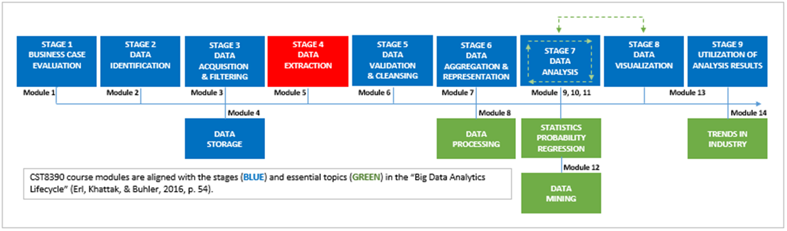
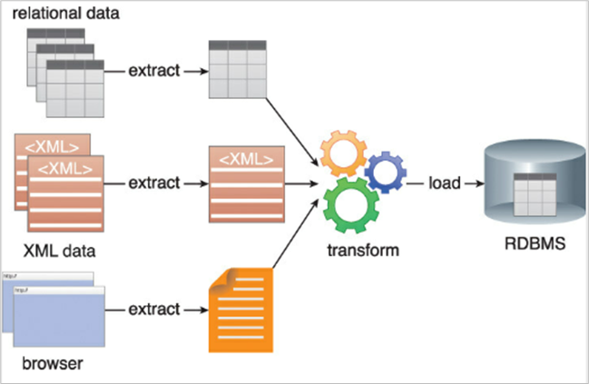
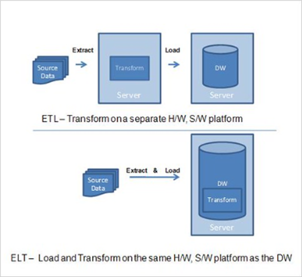

# Module 5: Data Extraction

## Introduction
- Data are summaries of thousands of stories; telling some stories helps make data meaningful.  
  *(Chip and Dan Heath)*  
- Scenario: You are a Databot on planet Datatron, powered by a data energy source called **Datajon**.  
- **Datajon** must be extracted and transformed into usable formats for immediate or future processing.  
- This module covers **data extraction**, stage four in the *Big Data Analytics Lifecycle*.  
- You will develop essential data mining skills to extract Datajon before rivals (Datcepticons) do.

### Learning Outcomes
By the end of this module, you will be able to:  
- Describe **ETL** and **ELT**, and explain their similarities and differences.  
- Identify two types of **logical data extraction**.  
- Describe two types of **physical data extraction**.  
- Explain **web scraping**.  
- Discuss three types of **data extraction tools**.  
- Explain challenges associated with data extraction.  
- Describe big data storage technologies, including **on-disk** and **in-memory** storage.  
- Set the test method and perform it in **Weka**.  
- Explain and conduct **KNN (K-Nearest Neighbor) learning** in Weka.  
- Explain and perform **attribute selection** in Weka.  
- Explain the effect of **class noise** on datasets and vary class noise settings in Weka.

### Key Terms and Concepts
- **Logical Extraction**: Obtaining full dataset copies or data copies timestamped after the last extraction.  
- **Physical Extraction**: Online data extraction and extraction of externally stored data.  
- **Web Scraping**: Manual or automated extraction of data from websites.  
- **ETL (Extract, Transform, Load)**: Copying data from sources into a different system format.  
- **ELT (Extract, Load, Transform)**: Extracting data and loading before transforming it for analytics use.

### Reading
- Erl, T., Khattak, W., & Buhler, P. (2016). *Big data fundamentals: Concepts, drivers and techniques*. Prentice Hall.  
- Reference: "Big Data Analytics Lifecycle" (Erl, Khattak, & Buhler, 2016, p. 54)

## Part of the Whole

- The stages in the **Big Data Analytics Lifecycle** are discussed separately in this course for clarity.  
- In reality, these processes execute at **microprocessing speeds**, especially in **BIDA** (Big Data Analytics) implementations with real-time streaming data analysis.  
- The objective remains to gain insights from data, but sometimes this must happen **as fast as possible**.  
- Because of this speed, the boundaries between processes like **data extraction**, **data validation**, and **data aggregation** can become blurred.  
- Keep this in mind as you study processes-within-a-process, such as:  
  - **Extract, Transform, Load (ETL)**  
  - **Extract, Load, Transform (ELT)**  
- ETL and ELT are integral to the backend of the data analytics process and consist of three distinct steps each.  
- The module will focus closely on the **Extract** process, examining it in detail from a data scientist’s perspective.

## ETL, ELT - Potayto, Potahto?

- **Rules** are binary bits of logic: what you *can* do (True) vs. what you *cannot* do (False).  
- **Business rules** apply this logic within business operations and processes, including data analytics and data extraction processes.  
- According to Erl et al. (2016, p. 79), **ETL** is "a process of loading data from a source system, modifying or transforming them by the application of rules, then loading them into a target system."

---

### Extract Transform Load (ETL)

- **Extract**  
  Pre-planned, regular harvesting of data from various source systems (databases, flat files, applications). Extract tools must handle different source types and protocols efficiently.

- **Transform**  
  Data is moved to a staging area where business rules are applied via scripts. Data cleansing happens here (removing corruptions, correcting repeats), and data is converted into formats suitable for front-end applications.

- **Load**  
  Transformed data is loaded into the target system (data warehouse, flat file) at timed intervals. Business rules decide whether new data appends, overwrites, or combines with old data. Data provenance (metadata) is updated to maintain an audit trail.

---

### Extract Load Transform (ELT)

- ELT performs the same functions as ETL but in a different order.  
- Data is extracted and **loaded first** into the target warehouse **without pre-formatting**.  
- Transformation happens inside the target database, enabling customized reporting.  
- ELT has higher storage overhead but is faster for data ingestion and near real-time mining.

---

### Summary

- Both ETL and ELT harvest, homogenize, and inventory data but in different sequences.  
- Choice depends on source data state, system capabilities, budget, and analytics goals.

## Stage 4: Data Extraction (Big Data Analytics Lifecycle)

### Overview
Data extraction is a **process-within-a-process-within-a-process** involving pulling data from source systems for analytics. It includes various methods, tools, and challenges.

---

### Methods of Data Extraction

#### Logical Data Extraction
- **Full Extraction:** Extract the entire dataset, usually done initially.
- **Incremental Extraction:** Extract only new or changed data since last extraction, by:
  - Extracting data timestamped after the last extraction, or
  - Extracting full dataset then computing the difference.

#### Physical Data Extraction
- **Online Extraction:** Data extracted directly from live source systems.
- **Offline Extraction:** Data extracted from externally stored files (e.g., flat files).

#### Web Scraping (a form of online extraction)
- Automated or manual fetching of website data using:
  - **Bots:** Automated repetitive internet tasks.
  - **Web Crawlers:** Bots that browse and index web content.
- Web scraping process:
  1. **Fetching:** Downloading web pages.
  2. **Extraction:** Parsing and reformatting data.
  3. **Copying:** Structuring data for analysis.

---

### Applications of Web Scraping
- Website content indexing
- Data mining
- Price monitoring and comparison
- Competitor review scraping
- Weather data monitoring

---

### Data Extraction Tools
- **Batch Processing Tools:** Scheduled, high-volume repetitive jobs; improve quality and speed.
- **Open Source Tools:** Cost-effective ETL/ELT tools, suitable for budget constraints.
- **Cloud-based Tools:** Real-time extraction leveraging cloud storage, analytics, security, and compliance.

---

### Challenges in Data Extraction
- **Security:** Protecting sensitive data (e.g., PII), encryption, privacy compliance.
- **Integration:** Combining diverse structured/unstructured data into usable analytics formats.

