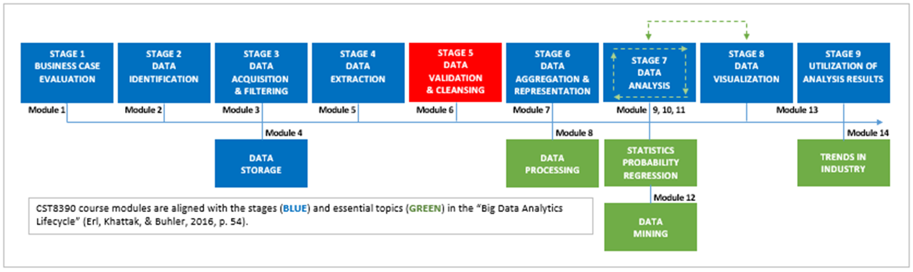
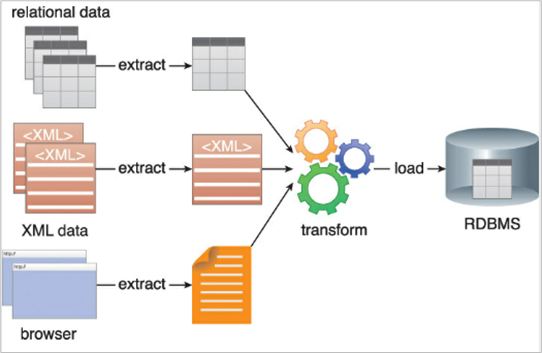

# Module 6: Data Validation and Cleansing

## Introduction

> *"Without a systematic way to start and keep data clean, bad data will happen."*  
> — **Donato Diorio**, Founder and CEO of DataZ

- The **matryoshka** (nesting doll) metaphor is used to describe the nested structure of the Big Data Analytics Lifecycle.
- In Module 5, you explored one layer of that nest: **ETL/ELT processes**, part of the **Transform** stage.
- Module 6 focuses on **data validation** and **data cleansing**, which together make up **stage five** of the analytics lifecycle.
- You'll dig into sub-processes within validation and cleansing, then synthesize your understanding through practical activities.

> Reference: “Big Data Analytics Lifecycle” (Erl, Khattak, & Buhler, 2016, p. 54)

---

### Learning Outcomes

By the end of this module, you will be able to:

- Describe the **Transform** process.
- Explain the role of **staging areas** in the Transform process.
- Interpret **Data Validation** in both:
  - Stage two of the Big Data Analytics Lifecycle.
  - Stage five of the Big Data Analytics Lifecycle.
- Describe **four types of data validation checks**.
- Define **data cleansing**.
- Apply data cleansing to **nine common data faults**.
- Implement **preprocessing dataset skills** in Weka.
- Use **text functions in Microsoft Excel** to clean an imported dataset.

---

### Key Terms and Concepts

- **Impute**  
  Calculating missing values based on other available observations.

- **Outliers**  
  Data values that are significantly different from other observations.

- **Staging Area**  
  Separate relational database servers where data is copied from source systems before transformation.

---

### Readings

- Erl, T., Khattak, W., & Buhler, P. (2016). *Big Data Fundamentals: Concepts, Drivers and Techniques*. Prentice Hall.

## Groovy

- In **Module 5**, you learned that **business rules** are applied during the **Transform** phase of the ETL process.
  - These rules modify the data to make it usable by data analytics tools.
  - If you're ready to enforce rules yourself, check out **Learning Activity 5** in this module.

- As previously discussed, **ETL** contains **processes within processes**:
  - 'Extract' is a sub-process of ETL.
  - Likewise, **'Transform'** is a sub-process that contains **its own sub-processes**:
    - **Data Validation**
    - **Data Cleansing**

- Both validation and cleansing make up **Stage 5** of the Big Data Analytics Lifecycle.

- **Mind-bending twist**:
  - **Data Validation**, though part of Stage 5, also plays a role in **Stage 2: Data Identification**.
  - That means you're performing a Stage 5 process during Stage 2 — and then again in Stage 5, but differently.

> The world of data analytics is recursive, layered, and at times paradoxical. Embrace the nested logic — your consciousness may expand.

## Of Ugly Ducklings and Mythical Greek Kings

- In Hans Christian Andersen’s story, an *ugly duckling* transforms — slowly and naturally — into a beautiful swan.
- In data analytics, your goal is similar: transform **dirty data** into **clean, valuable data** that yields **astonishing insights**.
  - Unlike the duckling, this transformation happens **mechanically** and at **microprocessing speeds**.

---

### The Cost of Ugly Data

- Unlike in Andersen’s tale, **ugly data is objectively problematic**.
- If left untreated, it may violate key **principles of business intelligence and data analytics**:
  - **Accuracy**
  - **Value**
- Without these, a third principle — **Actionability** — becomes impossible.

---

### Your Role: Be Like Pygmalion

> In Greek mythology, **Pygmalion** sculpted his ideal and watched it come to life.

- As a data steward, **shape your data** to match your business needs and tech capabilities.
- Well-formed data leads to **insights** that can illuminate decision-making — and impress in the boardroom.

---

### Takeaway

**Data transformation isn’t just technical — it’s strategic.**  
Clean data unlocks action. Ugly data blocks it.

## Another Part of Another Whole

In **Module 5**, you learned that the **ETL process** (Extract, Transform, Load) is part of the **back end** of the overall **data analytics process**.

You also discovered:
- ETL is composed of **three sub-processes**.
- You previously explored **Extract**.
- You will now dive into **Transform** and its inner workings.

---

### ETL Refresher (Erl et al., 2016, p. 79)

- **Extract**: Harvest data from internal and external source systems.
- **Transform**: Stage and convert data into formats usable by analytics tools.
- **Load**: Store transformed data in target systems (e.g., data warehouses).
- In **ELT**, the *Load* and *Transform* phases are inverted.
- **Metadata** (provenance) is updated throughout to maintain audit trails and dataset credibility.

---

## Overview of the Transform Process

- Think of **Transform** like *purgatory* — a cleansing zone where impure data is purified.
- **Staging areas** are used to hold data temporarily while transformation happens.

---

### What Staging Areas Do:

- Are **relational database servers**, separate from both source and target systems.
- Enable:
  - **Data consolidation** from multiple sources
  - **Validation** of relationships across datasets
  - **Efficient retrieval** by copying datasets in bulk
  - **Support for varied schedules** and multiple destinations
  - **Archiving** during or after loading

---

### Key Takeaway

Staging areas are like **petri dishes** for data transformation:
- Cleanse and map data for downstream use.
- Improve **data quality**, enabling:
  - **Consistency**
  - **Accuracy**
  - **Reliability**
  - **Completeness**
  - **Timeliness**
  - **Validity**

The **Transform** stage is not just about changing data — it’s about making data truly usable.

## Stage 5: Data Validation and Data Cleansing

Business rules help define what **can** and **cannot** be done to data during the analytics process.  
Stage 5 of the **Big Data Analytics Lifecycle** — *Data Validation and Cleansing* — is all about *sorting through* and *sorting out* data. This is where business rules are **applied in practice**.

---

### 🧪 Data Validation

**Data validation** is the process of checking the quality of source data **before** using, importing, or otherwise processing it.

> ❓ *Wait — before importing? Does that mean validation is a stage two process?*  
> ✅ Yes, validation happens at **stage two** (*Data Identification*) and again at **stage five**.

#### Stage 2 Validation
- Evaluates data against the **Five Vs** of big data:
  - Volume
  - Velocity
  - Variety
  - Veracity
  - Value
- Assesses whether data can be used to **drive business performance** through actionable insights.

#### Stage 5 Validation
- Confirms that data inputs to analytics tools are:
  - **Complete**
  - **Accurate**
  - **Secure**
  - **Consistent**
- Uses **data dictionaries** (files containing database metadata) to define business rules.

#### Common Validation Checks

| Type          | Description |
|---------------|-------------|
| **Type**      | Ensures correct data types are entered (e.g., integers in age fields). |
| **Range & Constraint** | Checks that values fall within defined limits or match specific patterns. |
| **Code**      | Applies organizational rules to format (e.g., email structure). |
| **Structured**| Ensures values match parameters (e.g., predefined job grades). |

> *Example*: Validate that each customer has first/last names with meaningful characters (type-check) and that address lines are joined properly (code-check).  
> — *Erl et al., 2016, pp. 86–87*

#### Final Thought
- **Validation** is not limited to stage two or five — it can occur **throughout** the lifecycle.
- **Provenance** supports data **veracity**, helping to defend the **credibility** of analytics outputs.

---

### 🧹 Data Cleansing

**Data cleansing** involves identifying and correcting invalid records using business rules and tech-stack capabilities.

#### Common Issues & Fixes

##### 🔸 Missing Values

| Method     | Action |
|------------|--------|
| **Drop**   | Remove rows or columns with missing values. |
| **Impute** | Estimate missing values using statistical or AI methods. |
| **Flag**   | Mark missing values as a separate category (informative). |

###### Imputation Methods (Grace-Martin):

- **Interpolation/Extrapolation**: Estimate based on nearby values.
- **Substitution**: Use data from similar external individuals.
- **Hot deck**: Randomly pick from similar samples.
- **Cold deck**: Use one similar sample as the source.
- **Mean**: Use average value.
- **Regression**: Use predicted value from a model.
- **Stochastic regression**: Add randomness to regression prediction.

##### 🔸 Irrelevant Data
- Drop data that does not fit the context or problem domain.

##### 🔸 Duplicates
- Remove repeated data points.

##### 🔸 Incorrect Data Types
- Convert data to the correct type (e.g., string to numeric).

##### 🔸 Syntax Errors
- Fix coding issues like extra spaces or malformed entries.

##### 🔸 Non-standard Data
- Convert data to standardized formats (e.g., units of measurement).

##### 🔸 Scale Mismatches
- Normalize scales (e.g., percentages to GPA).

##### 🔸 Outliers
- Investigate and possibly remove values far from the norm.

##### 🔸 In-record / Cross-dataset Conflicts
- Resolve contradictions across fields or datasets by retaining correct values.

---

**Summary**:  
Stage 5 is all about **refining** your data — applying business rules to *validate* and *cleanse* information so that the output of analytics is reliable, accurate, and actionable.
