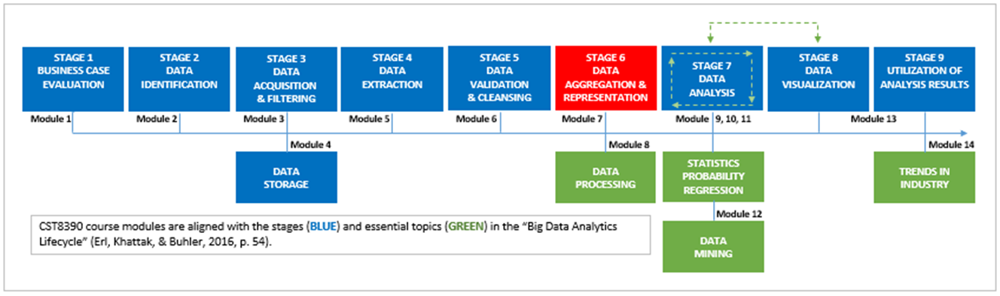
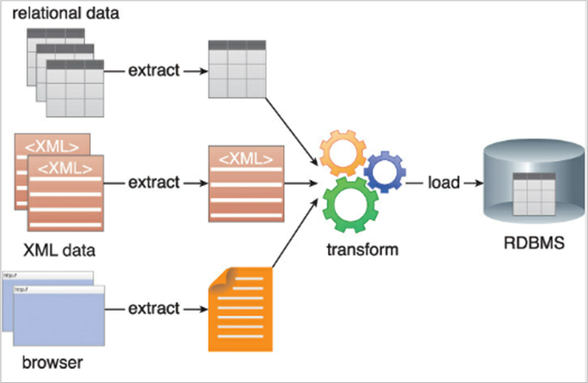
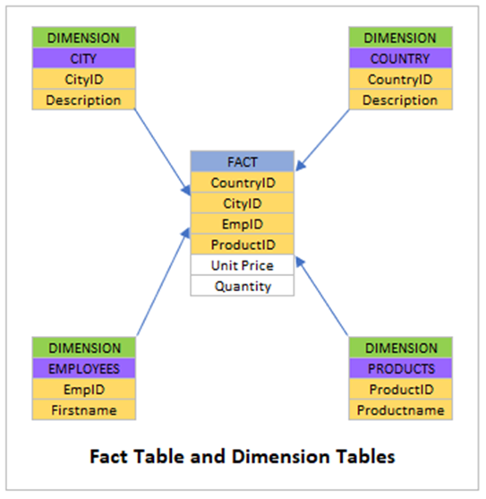

# Module 7: Data Aggregation and Representation

> *“When you are dealing with a torrent of data, being able to construct different levels of aggregation is really important, because you want to make sure you’ve used your software intelligently with respect to that large amount of data, and bring to bear the contextual data you need to answer the question at the level of aggregation that you need to answer it.”*  
> — *Michael O'Connell, Senior Director of Analytics, TIBCO*

---

## Introduction

By now, you've become familiar with the **ETL** process (Extract, Transform, Load), as defined by Erl et al. (2016):

> **ETL** is *"a process of loading data from a source system, modifying or transforming them by the application of rules, then loading them into a target system."*

You understand that:
- The **Transform** step includes sub-processes like *validation* and *cleansing*.
- In this module, you’ll focus on the **Load** phase and explore **data aggregation** and **representation**.

By mastering this module, you’ll also reinforce your understanding of **Stage 6** of the **Big Data Analytics Lifecycle**:

---

## Learning Outcomes

By the end of this module, you will be able to:

- ✅ Describe the **Load** process.
- ✅ Explain **two different types of load processes**.
- ✅ List **challenges** inherent to the load process.
- ✅ Explain the difference between **fact tables** and **dimension tables**.
- ✅ Define the **three steps** in the data aggregation process.
- ✅ Explain **feature selection** in data aggregation process design.
- ✅ Explain the differences between **four machine learning methods** in Weka.
- ✅ Aggregate and consolidate data using **Microsoft Excel**.

---

## Key Terms and Concepts

- **Aggregation**  
  Combining information from multiple datasets in a unified view.

- **Dimension Tables**  
  Tables that store attributes that describe the objects in a fact table.

- **Fact Tables**  
  Tables that hold numeric data that will be subject to analysis.

- **Representation**  
  The presentation of data types, such as numerical values or strings.

- **Taxonomy**  
  An orderly classification.

## Thrash (in Point Form)

- **Thrash** is a genre of extreme heavy metal music.
- Despite its aggressive sound, it often contains **social activist messages** in the lyrics.
- In **1996**, the thrash band **Metallica** released an album titled **_Load_**.
- The album is noted for being both **jarring** and **introspective**.
- Suggested listening if you're feeling low on BIDA inspiration — crank it up to boost your **analytics energy**.
- This music reference marks the end of the course’s **music appreciation** segment.
- The focus now shifts back to analytics: specifically, the **Load** stage of the ETL process.

## Load (in Point Form)

### ETL Context
- **ETL** = Extract, Transform, Load.
- First introduced in Module 5; focus now on the final stage: **Load**.
- ETL defined by Erl et al. (2016):  
  > "A process of loading data from a source system, modifying or transforming them by the application of rules, then loading them into a target system."
- The **Transform** stage includes **validation** and **cleansing**.
- Now moving into the **Load** stage and what follows when it's complete.

---

### What is Load?
- **Load** = final step of the ETL process.
- Moves validated and cleansed data into **data warehouses**.
- Data is stored in **tables** within the warehouse.
- Access is restricted during loading to:
  - Prevent processing of **incomplete datasets**.
  - Avoid **inaccurate analyses**.
  - Maintain **query performance** (front end and back end).

---

### Load Methods

#### 1. Full Load
- Loads the **entire dataset** in one go.
- Simple but can be resource-intensive.

#### 2. Incremental Load
- Loads only the **delta** (difference) between source and target.
- Based on the **last extract date**.
- More complex than full load.
- Two techniques:
  - **Batch**: for large data volumes.
  - **Streaming**: for small, real-time data flows.

---

### Challenges of Incremental Load
- **Order**: Data may be updated/deleted out of order in distributed systems, leading to bad data.
- **Schema**: Source schema changes (e.g., int → string) may not match the target, causing inconsistencies.
- **Failure**: Source, network, or target failures can worsen issues like order or schema mismatch.

---

### Data Warehouse Table Types

- **Fact Tables**:
  - Store large volumes of **numeric data** for analysis.

- **Dimension Tables**:
  - Store **descriptive attributes** of fact table entities.
  - Examples: employee name, website URL.

---

### Completion of Load
- Load process ends when all **tables are populated** with the most current data.
- At this point, the analytics process advances to **Stage 6** of the **Big Data Analytics Lifecycle**:  
  **Data Aggregation and Representation**.

## Stage 6: Data Aggregation and Representation (in Point Form)

### Overview
- **Data Aggregation**:  
  - Combines information from **multiple datasets** into a **unified view**.  
  - Enables effective **retrieval** and **analysis**.

- **Data Representation**:  
  - Expresses the unified view in appropriate **data types** (e.g., numbers, strings).

- **Challenges**:
  - **Dataset differences** (formats, schema, content).
  - **High data volumes**.
  - **Time constraints** for delivering analysis.

---

### Data Aggregation Process (DAP) — *Cai et al. (2019)*

- Proposed a structured approach for **designing aggregation processes**.
- Focus: Apply functions like:
  - `COUNT`
  - `SUM`
  - `AVERAGE`
  - etc.
- Goal: Produce meaningful results from specific sets of data values.

---

### DAP Context
- Used when **designing aggregation processes** to combine multiple datasets.
- Helps in making decisions about:
  - **What data to include**.
  - **How to aggregate**.
  - **Which functions to apply**.

---

### Three Phases of the DAP (Cai et al., 2019)

1. **Preparation**
   - Activities:  
     - Locating data  
     - Extracting data  
     - Validating data  
     - Cleansing data
   - In traditional BIDA architectures, this corresponds to the **ETL** phase.

2. **Aggregation**
   - Transforming **prepared data** into **aggregated data**.
   - Typically performed in **data warehouses**.
   - Often executed via **batch processing** over large datasets and extended timeframes.

3. **Post-aggregation**
   - **Storing** aggregated data.
   - Or making aggregated data available as **inputs to other processes** (e.g., analytics pipelines).

---

## Features in DAP Design (Cai et al., 2019)

- **Features** = Design elements used when implementing a DAP.
- Authors identify a set of **common features**, which they organize into a **taxonomy**.
- Recognize that **each BIDA implementation is unique**, so features must be **customizable**.

[DAP feature diagram legend: (1) Nodes with a solid dot are mandatory features (a); (2) Nodes with a circle represent optional features (b); (3) Nodes linked by a spanning curve represent a group of alternative features from which one must be selected (c); Annotations, such as [m..n], indicate the number of instances of a feature that are children of the feature’s parent.](images/dap.png)

## Preparation Phase Features (DAP)

- **Pull**  
  - Data are actively acquired from the source.  
  - If not pulled, data may be pushed by processes external to DAP.

- **Shared**  
  - Data accessed (read/updated) concurrently by other processes during aggregation.

- **Sheddable**  
  - Data that can be skipped during aggregation, e.g., outdated or irrelevant data.

- **Real-Time Data Constraints**  
  - Valid only if used within a specific **validity interval** after arrival.  
  - Types of real-time constraints/deadlines:

  1. **Hard Deadlines**  
     - Missing these can have **catastrophic consequences** (e.g., loss of life).

  2. **Firm Deadlines**  
     - Missing these renders analytics results **useless** (e.g., detecting vacant parking spots).

  3. **Soft Deadlines**  
     - Missing these **reduces the value** of results (e.g., signal processing for video meetings).

- **Task Scheduling Types**  
  - **Periodic**: Occur at **regular intervals**.  
  - **Sporadic**: Occur within **specified minimum and maximum intervals**.  
  - **Aperiodic**: Occur at **unpredictable intervals**.

## Aggregation Phase Features (DAP)

- **Duplicate Sensitive**  
  - Aggregation process sensitive to duplicate data; duplicates may affect results.

- **Exemplary or Summary**  
  - Aggregated data can be **exemplary** (representative samples) or **summary** statistics.

- **Lossy**  
  - An aggregate function is **lossy** if raw data **cannot be reconstructed** from the aggregated data (e.g., SUM).

---

## Post-Aggregation Phase Features (DAP)

- **Push**  
  - Aggregated data is **sent immediately** to another system component (e.g., storage) after aggregation.

- **Time-to-live**  
  - Defines how long aggregated data should be **preserved** before being discarded or overwritten.

[Complete DAP feature model.](images/complete_dap.png)

- DAP feature model example: Anti-Lock Braking System (ABS)
- Raw data includes:
  - Sensor readings
  - Wheel speed tracking
  - Brake pedal press by the driver
- Aggregation takes place in the vehicle’s onboard computer
- Braking torque is calculated from the raw data during aggregation
- Results are sent to an actuator for braking
- Hard deadlines are enforced to guarantee safety
- Purpose of hard deadlines: minimize opportunities for traffic accidents

[DAP feature model specific to an ABS system.](images/abs_dap.png)

## Summary

- "Am I just a node in a decision tree?" — Yes, and that’s powerful!
- You have the power to choose paths that lead to:
  - Wiser decisions
  - New opportunities
  - Expanding possibilities
- Having completed Module 7:
  - You’ve explored data loading and aggregation
- Next step: Module 8
  - Dive into the complexities of **data processing**
- Final message: *Live long and swim.*
