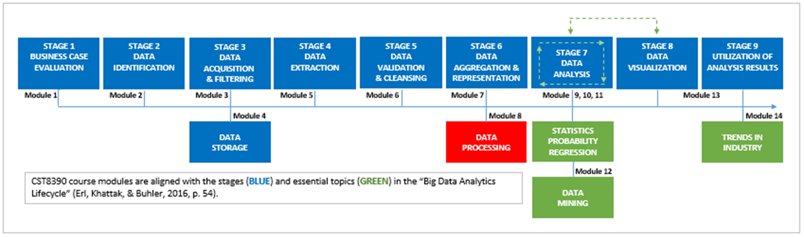
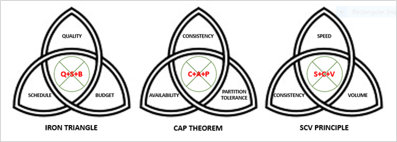

# Module 8: Data Processing

> "Every second of every day, our senses bring in way too much data than we can possibly process in our brains."  
> — *Peter Diamandis, Chairman/CEO, X-Prize Foundation*

## Introduction

- After data aggregation, data moves into the stage of **data processing**.
- While not a formal stage in the **Big Data Analytics Lifecycle**, data processing is essential to keep the analytics cycle going.
- It includes enhanced **strategies**, **architectures**, and **frameworks** for ensuring:
  - Timely
  - Accurate
  - Value-added insights
- Encourages continuous motion through the data lifecycle — *"keep the circle of data turning."*

---

## Learning Outcomes

By the end of this module, you should be able to:

- Describe the **SCV principle** of data processing.
- Define **parallel data processing**.
- Define **distributed data processing**.
- Describe the **Hadoop Distributed File System** (HDFS).
- Describe the **Hadoop MapReduce** process.
- Explain **batch data processing**.
- Explain **realtime data processing**.
- Explain why different **data classifiers** produce different **visualizations** of the same dataset.

---

## Key Terms and Concepts

### Parallel Processing
- Divides large tasks into smaller tasks and completes them concurrently.

### Distributed Processing
- Divides large tasks and distributes them across clusters of networked computers.
- Tasks may be performed in parallel.

### Hadoop
- A framework for managing **distributed files** on **distributed systems**.

### MapReduce
- An engine used in **batch processing**.
- Maps data types and values → reduces them into a summarized list.

### Event Stream Processing (ESP)
- A **realtime data processing** technique focused on **speed**.
- Continuously analyzes incoming events.

### Complex Event Processing (CEP)
- A form of **realtime processing** focused on **consistency**.
- Simultaneously analyzes data from **multiple sources**.

## Triquetra Constraints

The **triquetra** is a triangular figure composed of three interlaced arcs.

- Originates from the **Iron Age** (1200–550 BCE).
- Prominent in **Celtic symbolism**.
- Often represents the threefold division of the world: **land**, **sea**, and **sky**.

---

### Analytical Interpretation

As a BIDA analyst, the triquetra resembles a **Venn diagram** of constraints, symbolizing the tension between three competing priorities.

#### 1. Project Management – *The Iron Triangle* (Module 1)
- Constraints: **Quality**, **Schedule**, **Budget**
- Rule: You can optimize two, but not all three.

#### 2. Data Storage – *CAP Theorem* (Module 4)
- Constraints: **Consistency**, **Availability**, **Partition Tolerance**
- Rule: Choose any two, not all three.

#### 3. Data Processing – *SCV Principle* (Module 8)
- Constraints: **Speed**, **Consistency**, **Volume**
- Again, full optimization of all three is not feasible.

---

### Visual Summary

> The triquetra captures the essence of compromise across domains—whether in project planning, system design, or data processing.

## SCV Principle

Earlier in the course, you learned that **distributed computing** enables autonomous systems to communicate over a network, offering:

- Fault tolerance
- Enhanced performance

However, **distributed systems** are subject to constraints—just like the **CAP Theorem** in distributed data storage:

#### CAP Theorem (Review)
- **Consistency (C):** All clients see the same data at the same time.
- **Availability (A):** Requests return responses, even if nodes are down.
- **Partition Tolerance (P):** The system continues operating despite network partitions.

⚠️ **You can only achieve two out of the three.**

---

### SCV Principle (Data Processing Constraints)

Like CAP, **distributed data processing** faces its own set of three interdependent constraints, known as the **SCV Principle**:

> “A distributed data processing system can be designed to support only two of the following three requirements: **Speed**, **Consistency**, and **Volume**.”  
> — *Erl et al. (2016, p. 137)*

#### Definitions
- **Speed (S):** The rate of data processing (e.g., executing an algorithm).
- **Consistency (C):** The accuracy and precision of the results.
- **Volume (V):** The amount of data being processed.

---

### Constraint Trade-offs

1. **Speed + Consistency ⇒ Not Volume**
   - High-volume processing slows everything down.

2. **Consistency + Volume ⇒ Not Speed**
   - Processing large datasets accurately takes time.

3. **Speed + Volume ⇒ Not Consistency**
   - Fast processing of big data often relies on sampling, reducing precision.

---

#### Design Decisions

The SCV constraint to **exclude** depends on your system's purpose:

- Real-time applications? → Prioritize **Speed** and **Consistency**
- Data lakes? → Favor **Volume** and **Consistency**
- Marketing analytics? → Maybe choose **Speed** and **Volume**

> Choose wisely based on your analytics environment's goals.  
> — *Erl et al., 2016, p. 138*

## Data Processing

> “Enter the term 'data processing' into your preferred search engine and you will be returned a variety of definitions.”

### General Definition

Data processing encompasses various stages, often including:

- **Collection** (a.k.a. acquisition/extraction)
- **Storage**
- **Preparation/Input** (validation, cleansing, aggregation, loading)
- **Processing**
- **Output/Interpretation** (analysis, visualization, utilization)

---

### Focus in This Module: Processing

Processing means **performing defined operations** on data to **organize and present** it as **useful information**.

There are two main categories:

#### Batch Processing (Offline)
- Executes complex queries over **large datasets** over **extended periods**.
- Imposes **latency costs**.
- Typically aligns with **Consistency + Volume (C+V)** from the SCV Principle.
  
#### Realtime (Stream) Processing
- Handles **small packets of data continuously** as they arrive.
- Like batch processing, still processes **large volumes**.
- Tends toward:
  - **Speed + Volume (S+V)** — prioritize speed
  - or **Consistency + Volume (C+V)** — prioritize accuracy

---

### Processing Strategies

#### Parallel Processing
- Divides large tasks into **smaller sub-tasks** processed **simultaneously**.

#### Distributed Processing
- Uses **networked clusters of computers**, each working on different parts of a larger task.

---

### Hadoop Framework

#### HDFS (Hadoop Distributed File System)
- Stores **large structured and unstructured datasets** on clusters of servers.
- Files are split into **blocks**, which are **replicated** across **data nodes**.
- **NameNode** manages metadata, locations, and access.

---

### Hadoop MapReduce

A batch processing engine that runs **where the data lives**.

#### MapReduce Tasks

##### Map Task
- **Map:** Dataset is split and transformed into key-value pairs.
- **Combine:** Values for the same key are combined.
- **Partition:** Records with the same key are grouped into partitions.

##### Reduce Task
- **Shuffle:** Moves partitioned data to reduce nodes.
- **Sort:** Groups keys and values.
- **Reduce:** Final summaries or results are created.

🧠 **MapReduce is best for C+V** systems, where speed is not the main concern.

[MapReduce Example.](images/mapreduce.png)

---

### Realtime Data Processing

- Data are **processed in-memory** (before storage).
- Functions range from **basic** to **complex**.

#### Event Stream Processing (ESP)
- **Prioritizes speed (S)**
- Uses **formula-based algorithms** to analyze a continuous stream (typically one source).
- Outputs go to:
  - User dashboards
  - Additional analytics layers

#### Complex Event Processing (CEP)
- **Prioritizes consistency (C) and quality**
- Uses **rules-based, statistical, and business logic**
- Works with **multiple data sources**, often with variable arrival times

---

## Summary

- In real life, the magic word is “Please.”
- In real-time data processing, the magic word is “Now.”
- Batch systems can afford latency; real-time systems cannot.
- Both batch and real-time systems process large volumes of data.
- According to the SCV principle, you can only optimize two of: speed (S), consistency (C), and volume (V).
- Real-time systems typically prioritize:
  - Speed (S) and Volume (V), or
  - Consistency (C) and Volume (V)
- Real-time processing may sacrifice speed when accuracy (C) is critical.
- Module 9 explores:
  - What happens to data during real-time processing.
  - What you do to data after MapReduce.
  - The blurred lines between system-level processing and human data analysis.
