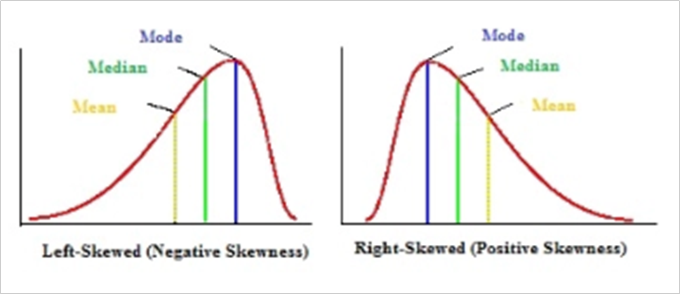

# 📘 Module 9: Data Analysis – Statistics

## ✅ Learning Outcomes
- Explain:
  - Qualitative analysis
  - Quantitative analysis
  - Statistical analysis
- Interpret three types of statistical data
- Define the term **statistic**
- Identify a **normal distribution**
- Explain **descriptive statistics**
- Identify and calculate:
  - Descriptive statistics
  - Percentiles
  - Covariance
  - Correlation
- Explain **discretization**
- Implement **supervised discretization**

## 🧠 Key Terms and Concepts

- **Correlation**  
  A measure of the strength of the relationship between two variables.

- **Covariance**  
  A measure of the relationship between two variables, without estimating the strength of the relationship.

- **Discretization**  
  Transforming numeric attributes to nominal.

- **Distributions**  
  An arrangement of the values of a variable that shows their observed or theoretical frequency of occurrence.

- **Mean**  
  The average value in a dataset.

- **Percentiles**  
  A value indicative of the rank of a score relative to other scores in a dataset.

- **Qualitative Analysis**  
  A data analysis technique that involves analyzing data that are subjective and not numerical.

- **Quantitative Analysis**  
  A data analysis technique that uses statistical methods to summarize the features of a dataset, or to generalize from it to a larger population.

- **Standard Deviation**  
  A descriptive statistic that shows the degree to which data points are dispersed around the mean.

- **Supervised Discretization**  
  Taking class into account when making discretization decisions.

## Data Analysis

- **Quantitative Analysis:**  
  Uses statistical methods to summarize data and generalize to populations. Involves numerical data collected in large samples.

- **Qualitative Analysis:**  
  Analyzes non-numerical, subjective data (e.g., color, gender, taste). Results usually cannot be generalized due to small samples.

- **Statistical Analysis:**  
  Uses mathematical formulas to analyze data. Types of statistical data:  
  - Numerical (Discrete & Continuous)  
  - Categorical (qualitative groups)  
  - Ordinal (ranked categories with meaningful numbers)

- **Learning Activity Examples:**  
  - Gas purchased: Numerical, continuous  
  - Hair color: Categorical  
  - Pay bands (A, B, C, D): Ordinal

- **Statistic:**  
  Data from part of a population; used to produce meaningful information (mean, median, mode).

- **Normal Distribution:**  
  Bell curve shaped by mean (center) and standard deviation (spread). Small deviation → steep curve; large deviation → flat curve.

## Descriptive Statistics

- **Descriptive vs. Inferential Statistics:**  
  - Descriptive: Summarizes sample data features without making predictions.  
  - Inferential: Makes predictions about a population from a sample (covered in module 10).

- **Key Descriptive Statistics:**  
  - **Mean:** Average value (sum ÷ count).  
    *Example:* Mean of 10, 6, 20 = (10 + 6 + 20) / 3 = 12  
  - **Mode:** Most frequent value.  
    *Example:* Mode of 21, 21, 21, 23, 24, 26 = 21  
  - **Median:** Middle value in ordered data.  
    *Example:* Median of 23, 24, 26, 26, 28, 29, 30, 31, 33 = 28  
  - **Range:** Difference between max and min values.  
    *Example:* Range of 7 to 99 = 99 - 7 = 92  
  - **Variance:** Average of squared differences from the mean (measures spread).  
  - **Standard Deviation:** Square root of variance; shows data dispersion around the mean.  
    - Low SD: data close to mean  
    - High SD: data spread out

- **Skewness:**  
  - Measures asymmetry of data distribution.  
  - **Skewed left (negative):** Long left tail; mean < peak.  
  - **Skewed right (positive):** Long right tail; mean > peak.

- **Other terms:**  
  - **Count:** Total number of values.  
  - **Maximum:** Highest value.  
  - **Minimum:** Lowest value.

- **Use:** Descriptive analytics explain past events and causes, often applied in sales, marketing, finance, and operations.

## Percentiles

- Percentiles indicate relative standing in a dataset (range 0–100).
- To calculate the kth percentile:  
  1. Order data from smallest to largest.  
  2. Multiply k by total number of values → index.  
  3. If index is not whole, round up and select that value.  
  4. If index is whole, average the value at index and the next value.  
- Percentiles show the value below which a given percentage of data falls.  
  - Example: 90th percentile means 90% of scores are below that value.

## Covariance

- Measures how two variables change together (direction of relationship).  
- Positive covariance: variables move in the same direction.  
- Negative covariance: variables move in opposite directions.  
- Does **not** measure strength or dependency of the relationship.  
- Calculated by multiplying units of the two variables; values can be positive or negative.  
- Important in finance for portfolio diversification to minimize risk by selecting assets with low positive covariance.

## Correlation

Correlation builds on covariance by measuring **both the direction and strength** of the relationship between variables.

- **Covariance** shows direction only.
- **Correlation** scales covariance and is **dimensionless**.
- A **correlation coefficient (r)** ranges from:
  - `+1`: Perfect positive correlation.
  - `-1`: Perfect negative correlation.
  - `0`: No correlation.

The **Pearson Correlation Coefficient** is the most commonly used and assumes a **linear relationship** between variables.

### Interpretation of r values:

- The **absolute value** of r shows the **strength** of the relationship.
  - Example: |−0.75| = 0.75 → stronger than 0.65.

*Source: Correlation coefficient: Simple definition, formula, easy steps. (n.d.). Statistics How To.*

### Important Notes:

- **Correlation does not imply causation**.
  - A third variable (confounding factor) may be influencing both.
- In business, correlation is used to:
  - Enhance processes.
  - Reduce costs.
  - Support data-driven decisions.
  - Handle uncertainty and risk.

## Summary

- You’ve explored key **statistical analysis** concepts including:
  - Percentiles
  - Correlation
  - Descriptive statistics

- You practiced some **numerical reasoning**—a workout for your brain.

- Up next in **Module 10**:
  - Transition from **descriptive** to **predictive** analytics.
  - Dive into **Probability** and explore how statistics can hint at what’s to come.
  - Get ready to turn from observer to **data fortune teller**!
