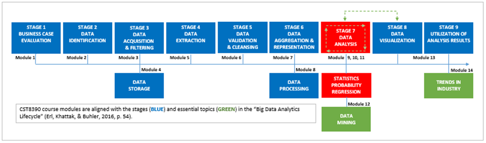
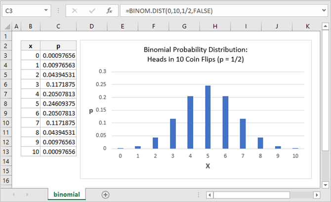
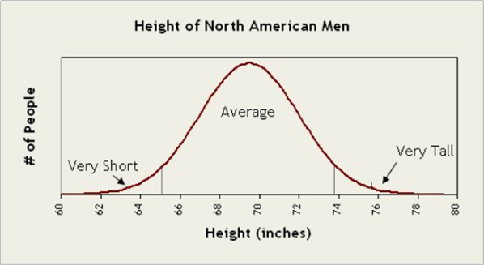

# Module 10: Data Analysis - Probability

## Introduction

> *"An unsophisticated forecaster uses statistics as a drunken man uses lamp-posts — for support rather than for illumination."*  
> — Andrew Lang, Scots Man of Letters

- In Module 9, you learned about:
  - Measures of central tendency
  - Measures of dispersion
  - Correlation as a measure of association

- Correlation shows **relationships**, but not **causation**, due to potential **confounding factors**.

- This module introduces **Probability**, your tool for:
  - Quantifying uncertainty
  - Assessing risk and opportunity
  - Making predictions

---

### Learning Outcomes

By the end of this module, you should be able to:

- Identify and explain **probability**
- Explain **discrete distributions**
- Explain **continuous distributions**
- Calculate the **probability** of an event
- Use the **binomial probability formula**
- Interpret **business applications** of probability

---

### Key Terms and Concepts

- **Binomial Distribution**: A distribution with two possible outcomes: **success** or **failure**.

- **Complementary Events**: Events where only **two outcomes** are possible.

- **Continuous Probability Distribution**: Distribution involving **continuous variables** that can take on **infinite values**.

- **Disjoint Events**: Events that **cannot happen at the same time**.

- **Independent Events**: Events where the occurrence of one **does not affect** the other.

- **Probability**: A measure of **how likely** an event is to occur.

- **Probability Range**: Values range from **0 to 1** (or **0% to 100%**).

## Measure for Measure

- In Module 9, you reviewed **measures of central tendency**:
  - **Mean**, **median**, and **mode** summarize trends in datasets.

- The **mean** provides a reference point for **measures of dispersion**:
  - Includes **variance** and **standard deviation**.
  - These show how data points behave relative to the mean.
  - Enables comparisons across datasets (e.g., similar means, different variability).

- **Measures of association** reflect relationships between variables:
  - **Covariance** shows if a directional relationship exists, but not its strength.
  - **Correlation** goes further:
    - Quantifies both **direction and strength** of relationships.
    - Suggests proportional changes between variables.
    - Does **not imply causation** due to potential **confounding factors**.

- **Correlation** introduced a **predictive element** not seen in central tendency or dispersion.

- This module builds on that predictive insight by exploring **probability**.

# Probability

> *"It is a part of probability that many improbable things will happen."*  
> — Aristotle

## What is Probability?

- **Probability** measures the likelihood of an event or proposition.
- Expressed as a number between **0 and 1**:
  - **0** = impossible
  - **1** = certain
- Based on **random events** with unpredictable outcomes (e.g., dice rolls).
- Outcomes form a **range**, and probability calculates the likelihood of each.

## Types of Random Variables

- A **random variable** represents outcomes of random events and is denoted as **X**.
- Two main types:
  - **Discrete**: Countable outcomes (e.g., # of coins in a jar)
  - **Continuous**: Uncountable outcomes (e.g., human height)

## Example: Dice Roll Probability Distribution

| Roll | 1 | 2 | 3 | 4 | 5 | 6 |
|------|---|---|---|---|---|---|
| Odds | 1/6 | 1/6 | 1/6 | 1/6 | 1/6 | 1/6 |

## Binomial Random Variables

- Discrete variables with **two possible outcomes** (SUCCESS or FAILURE).
- **Conditions for Binomial Distribution**:
  1. Fixed number of trials (**n**)
  2. Each trial has two outcomes (e.g., success/failure)
  3. Probability of success (**p**) is constant
  4. Trials are **independent**

### Example: 10 Coin Flips

- n = 10 (fixed trials)
- Two outcomes: heads/tails
- Fair coin: p = 0.5 for heads
- Each flip is independent  
✅ All conditions met → X has a **binomial distribution**

### Visualization

> Note: These curves may resemble a bell curve but don’t necessarily match a normal distribution.

## Continuous Random Variables

- Represent uncountable values (e.g., population height)
- Visualized using a **normal distribution**

> Source: Yann. (2015). Paper Windows. [Link](https://newspaperwindows.wordpress.com/2015/10/07/power-laws-network-degree-and-population)

## Business Applications

- **Macro-level**: Revenue predictions (e.g., probability of earning $100K–$500K/month)
- **Operational level**: Forecast unit sales and revenue using probability distributions
- Helps plan for best/worst-case scenarios  
> Source: Hanks, *The role of probability distribution*

---

## 📌 Calculating Probability

### Basic Formula

\[
P(A) = \frac{r}{n}
\]

- **P(A)** = Probability of event A  
- **r** = Number of favorable outcomes  
- **n** = Total number of outcomes

### Example: Factory Rejects

- Box: 5 too small, 3 too big, 2 under-inflated (total = 10)

Questions:

1. **Too small**:  
   \[
   P(A) = \frac{5}{10} = 0.5
   \]

2. **Too small or under-inflated**:  
   \[
   P(A) = \frac{5 + 2}{10} = 0.7
   \]

3. **Not under-inflated**:  
   \[
   P(A) = \frac{8}{10} = 0.8
   \]

---

## 🎯 Binomial Probability Formula

\[
P(X = x) = \binom{n}{x} \cdot p^x \cdot (1 - p)^{n - x}
\]

Where:
- \( n \) = number of trials  
- \( x \) = number of successes  
- \( p \) = probability of success in a single trial  
- \( 1 - p \) = probability of failure  

> Use this to compute the probability of exactly **x successes** in **n trials**.

---

## Business Applications of Probability

Probability supports business decision-making by helping assess **risks** and **opportunities**, much like correlation analysis. Key applications include:

- **Investment**:  
  Use probability to evaluate potential gains/losses and choose investment combinations with the highest expected return.

- **Customer Service**:  
  Model efficiencies in service systems to improve customer retention and inform policy changes.

- **Competitive Strategy**:  
  Analyze short-term risks and long-term outcomes to guide strategic planning under uncertainty.

- **Product Design**:  
  Assess the probability of product failure to improve design and draft effective warranties or return policies.

> *Source: Verial (2019).*

## Summary

- You've explored **probability** through the words of poets, philosophers, and novelists.
- Applied **probability formulas** to real-world-style examples.
- Got hands-on with calculating both:
  - The basic probability of an event.
  - Binomial probabilities for discrete outcomes.
- Hopefully, the concepts landed smoothly—no wheels falling off.
- Now you're ready for the final episode of the "Stage 7 Trilogy":  
  **Regression** – featuring:
  - A *big reveal*
  - A *gut-wrenching twist*
- You just might want to go back and **binge the whole course again**.  
  Cool.
