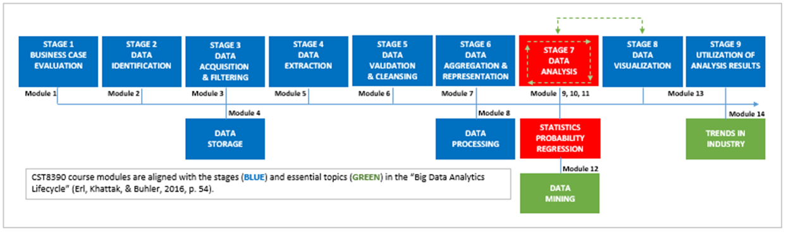

# Module 11: Data Analysis - Regression

## Introduction

> *Regression analysis is the hydrogen bomb of the statistics arsenal.*  
> — Charles Wheelan, Author, Journalist

Time to go where many have boldly gone before. Leave behind the comforts of central tendency, correlation, and probability.

Yes, take on the rigors of **linear regression analysis** and, afterwards, join that exclusive club of humans who live and breathe within three standard deviations of the mean and who *almost* know what’s going on.

But, there is one thing you do know, for certain: when you get to the end of this module, you’ll be finished **Stage 7** of the **Big Data Analytics Lifecycle**, and moving on to **Stage 8**.

Wait — that’s *two* things. Also... are you really certain you’ll be done with data analysis? Looks like there may be more topics coming up that still have a data analytics flavor.

*“It's only fitting,”* you say. *“After all, this is a data analytics course, isn’t it?”*

---

### Learning Outcomes

By the end of this module, you should be able to:

- Explain what is meant by **random sampling** and differentiate between types of random sampling.
- Identify **systematic sampling** and complete a simulated systematic sampling exercise.
- Differentiate between **univariate**, **bivariate**, and **multivariate** datasets.
- Explain what is meant by **inferential statistics**.
- Describe the **hypothesis testing** process.
- Define **simple linear regression analysis**.
- Recognize the components of the **simple linear regression equation** and use it to **predict numerical values**.
- Define **multiple linear regression**.
- Recognize the components of the **multiple linear regression equation** and use it to **predict numerical values**.

---

### Key Terms and Concepts

- **Bivariate Datasets**  
  Datasets that contain exactly two variables per observation.

- **Hypothesis**  
  An educated guess, based on prior knowledge, that can be tested for veracity.

- **Hypothesis Testing**  
  The process of analyzing data to determine the probability that a hypothesis is true.

- **Inferential Statistics**  
  A method used to generalize to a population based on findings from a subset.

- **Multiple Linear Regression**  
  A form of analysis that evaluates the effects of two or more independent (predictor) variables "X" on one (responder) variable "Y".

- **Multivariate Datasets**  
  Datasets that contain more than two variables per observation.

- **Random Sampling**  
  A method in which every item in a population has an equal chance of being chosen.

- **Systematic Sampling**  
  A sampling method using a fixed, periodic interval to select items.

- **Univariate Datasets**  
  Datasets consisting of observations on a single characteristic or attribute.

## The Final Frontier

- *“Captain, I am obliged to inform you that the statistical likelihood that our plan will succeed is less than 3.6 percent!”*
- How do you, a graduate of the interplanetary data science academy, calculate those odds **without** advanced tech?
- Because you've **mastered probability** – that was the **last module**.
- This module shifts focus to **inferential statistics**, including:
  - **Regression analysis**
  - Tools that help **predict outcomes** and avoid disastrous scenarios (like space gas shortages and gravitational tow trucks... aka black holes).
- Proper use of inferential statistics could help you **steer clear of trouble**.

## Collisions

- You're rested, caffeinated, and ready — you've already mastered descriptive and probability statistics.
- Life’s full of events: pen runs out, balloon lands, laundry dries, tree falls.
- **Multivariate regression** aims to model how **multiple variables** interact and influence one another.
- Think of it as **crashing dots together** with mathematical precision.
- It’s the **most complex topic** in the course — covered in more detail later.
- For now, you’ll focus on **foundational topics**:
  - **Sampling**
  - **Datasets**
  - **Hypothesis testing**
- Time to dig in and **build your foundation** for inferential statistics.

## The Font: Where Data Comes From

- Data can be acquired or **generated through empirical research**.
- When existing data isn't enough, conduct your **own studies** on a defined population.
- Use **sampling** to collect representative data from that population.

### Sampling Basics

- Good sampling ensures your data represents the broader population.
- **Convenience sampling** (e.g., polling friends) is quick but biased and not generalizable.
- Preferred sampling methods for business statistics:
  - **Random sampling**
  - **Systematic sampling**

### Random Sampling

- Every member of the population has an **equal chance** of selection.
- Example: Draw 25 employee names from a hat out of 250.

#### Stratified Random Sampling

- Population divided into **strata** (e.g., gender, education).
- Samples are taken **proportionally** from each group.
- Useful for ensuring subgroup representation but requires more info.

### Systematic Sampling

- Select every **nth** item from a population, starting from a random point.
- Interval = Population size / Sample size.
- Example: For 300 cheques, select 60 → Interval = 5 → Start at random point, pick every 5th.

### Margin of Error

- Sampling introduces possible **error**.
- **Larger samples** → smaller margins of error.
- Typical surveys (1,000–1,500 people) aim for a **3% margin of error**.

### Why It Matters

- Accurate sampling helps you **understand customer needs**.
- Leads to better products and services with a **higher probability of success** in target markets.

## The Maze: Organizing and Analyzing Your Data

- After collecting data, organize it into a dataset aligned with your research question.
- Choose from **three types of datasets**: univariate, bivariate, and multivariate.

---

### Univariate Datasets

- Involve a **single variable** per observation.
- Used for **descriptive statistics**:
  - Central tendency (mean, median, mode)
  - Dispersion (range, variance, standard deviation)
- Visualization methods:
  - Frequency tables
  - Bar charts
  - Histograms
  - Pie charts
- Good for identifying **trends**, not relationships.

---

### Bivariate Datasets

- Involve **two variables** per observation.
- Allow you to analyze **relationships between variables** (X and Y).
- Common tools:
  - **Scatter plots**: Visualize relationships
  - **Regression analysis**: Model the relationship between variables
  - **Correlation coefficients**: Measure strength/direction of relationships (range: -1 to +1)

---

### Multivariate Datasets

- Involve **more than two variables** per observation.
- Used for **multivariate analysis**:
  - Multiple dependent and/or independent variables
- Focus in this course: **Multiple regression analysis**
  - Tests if an outcome is influenced by several predictors
  - Calculates effect size and statistical significance for each predictor
- Example use case:
  - Examining how education, experience, gender, and ethnicity affect income

> Note: True multivariate analysis (multiple dependent + independent variables) is complex and studied in advanced courses.

## Inferential Statistics

- **Definition of "Infer":**
  - Implies sophisticated, indirect conclusions.
  - Fits inferential statistics, which draws conclusions about populations based on sample data.

---

### Purpose

- Allows for **generalization** from a sample to a population.
- Core function: **Hypothesis testing**

---

### Hypothesis Testing

- A **hypothesis** is an educated guess, often framed as:
  - **H1 (Alternative Hypothesis)**: Predicts an effect or change.
    - E.g., "If BIDA infrastructure is upgraded, then decision making improves."
  - **H0 (Null Hypothesis)**: Predicts no effect or change.
    - E.g., "The existing BIDA infrastructure does not contribute to poor decision making."

---

### Mathematical Framing

- Hypotheses can be expressed numerically:
  - **H1**: µ > 6 (mean outcome improves significantly)
  - **H0**: µ ≤ 6

---

### Importance of the Null Hypothesis

- Encourages **objectivity**.
- You don't prove H1 directly—you **test** whether H0 can be rejected.

---

### Four Steps of Hypothesis Testing

1. **State hypotheses**: H0 and H1 — only one can be correct.
2. **Design analysis plan**: Choose statistical methods and significance levels.
3. **Collect and analyze sample data**.
4. **Draw conclusions**:
   - Reject H0 → support for H1.
   - Fail to reject H0 → H1 not supported by the data.

---

### Bottom Line

- Hypothesis testing transforms **guesses into defensible insights**.
- It's essential for making **data-backed generalizations**.

---

## Regression Analysis

- Described as the **"hydrogen bomb of the statistics arsenal"** for its power and utility.
- Enables **hypothesis testing** about relationships between variables.
- Builds on earlier concepts:
  - Sampling → Datasets → Hypothesis Testing → Regression

---

### Purpose

- Identifies relationships between variables.
- Used to:
  - Detect trends
  - Evaluate decisions (e.g., pricing impacts)
  - Make forecasts

---

## Linear Regression

- Describes relationship between:
  - **Independent variable (X)** → predictor
  - **Dependent variable (Y)** → response

---

### 1. Simple Linear Regression

- Models the relationship between **one independent** variable (X) and **one dependent** variable (Y).
- Visualized with:
  - **Scatter plot**: data points
  - **Line of best fit**: regression line

---

#### Types of Relationships

- **Positive correlation**:
  - Line slopes **upward**
  - As X increases, Y increases

- **Negative correlation**:
  - Line slopes **downward**
  - As X increases, Y decreases

- **No correlation**:
  - Line is approximately **horizontal**
  - X has **irregular or no effect** on Y

---

### Regression Formula

    y = bx + a + ε

- **y**: Dependent (response) variable
- **b**: Slope of the regression line
- **x**: Independent (predictor) variable
- **a**: Constant (y-intercept)
- **ε**: Error term (unexplained variability)

---

## Multiple Linear Regression

- Extends **simple linear regression** by including **two or more independent variables**.
- Assumes a **linear relationship** between independent variables (X) and dependent variable (Y).

---

### Mathematical Model

\[
y = a + bx_1 + cx_2 + dx_3 + \varepsilon
\]

Where:  
- \(y\) = dependent (response) variable  
- \(x_1, x_2, x_3\) = independent (predictor) variables  
- \(b, c, d\) = change in \(y\) per unit change in \(x_1, x_2, x_3\) respectively  
- \(a\) = constant (y-intercept)  
- \(\varepsilon\) = error term (unexplained variability)  

> **Note:** Independent variables should not be highly correlated with each other (to avoid multicollinearity).

---

### Example: Predict Annual Sales

- Variables:
  - \(y\) = Sales (dependent variable)  
  - \(b = 34,356.085\) (change in sales per year of education)  
  - \(c = -3,657.213\) (change in sales per point on Higgins Motivational Scale)  
  - \(x_1 = 13\) (years of education)  
  - \(x_2 = 49\) (Higgins Motivational Scale score)  
  - \(a = 60,049.195\) (constant)  

---

### Calculation:

\[
y = a + b x_1 + c x_2
\]

\[
y = 60,049.195 + (34,356.085 \times 13) + (-3,657.213 \times 49)
\]

\[
y = 60,049.195 + 446,629.105 - 179,203.437 = 327,474.863
\]

**Prediction:** Annual sales = **$327,474.86**

---

### Practice Problem:

- Given:
  - \(b = 34,356.085\)
  - \(c = -3,657.213\)
  - \(x_1 = 12\)
  - \(x_2 = 32\)
  - \(a = 60,049.195\)

Calculate:

\[
y = 60,049.195 + (34,356.085 \times 12) + (-3,657.213 \times 32)
\]

\[
y = 60,049.195 + 412,282.20 - 117,030.816 = 355,900.384
\]

**Prediction:** Annual sales = **$355,900.38**

---

## Summary

- Your data survey found **96% of neighborhood beings showed signs of life** — a positive, reassuring result.
- Based on this evidence, you **reject the null hypothesis** that regression analysis is useless or harmful.
- You’re now confident to move past **stage seven** of the Big Data Analytics Lifecycle.
- Next up: **stage eight**, data mining — where you’ll test and potentially disprove the null hypothesis that stage eight doesn’t follow stage seven.
- In other words, your journey through data analysis continues, guided by evidence and careful hypothesis testing.
