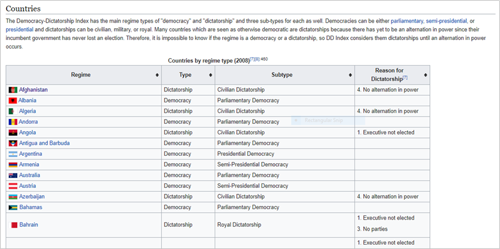
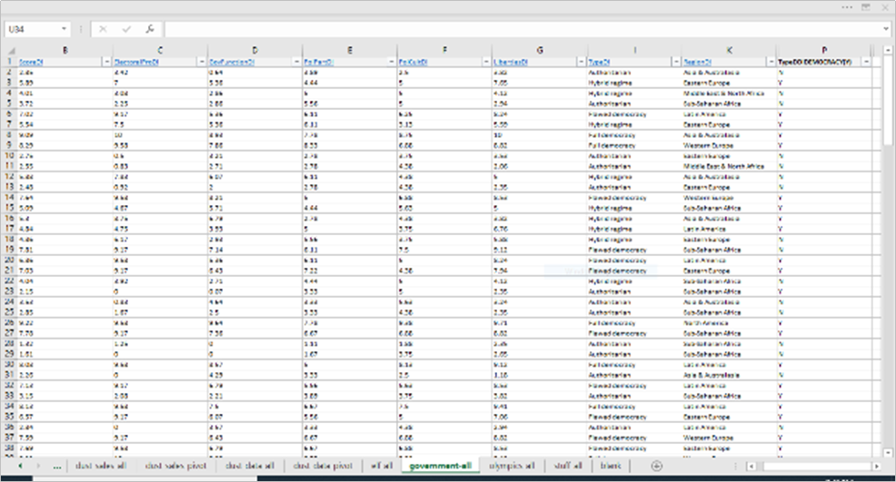
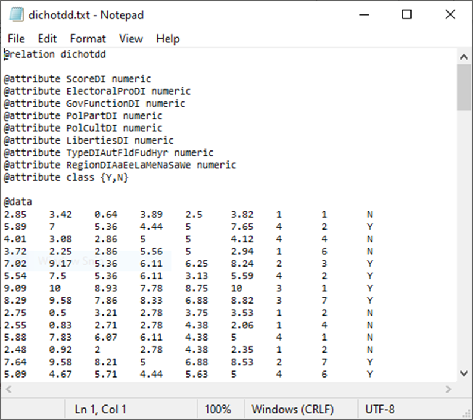
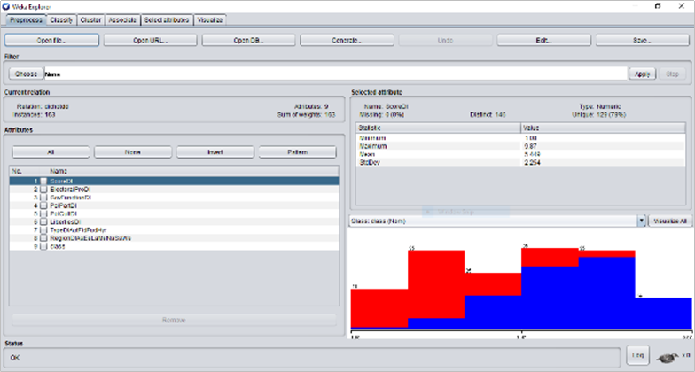
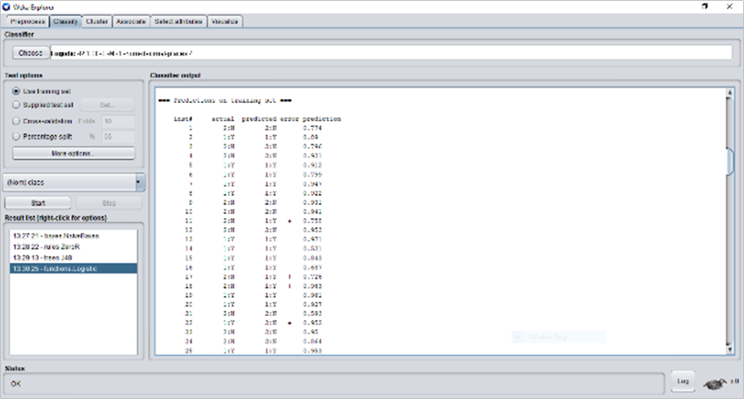
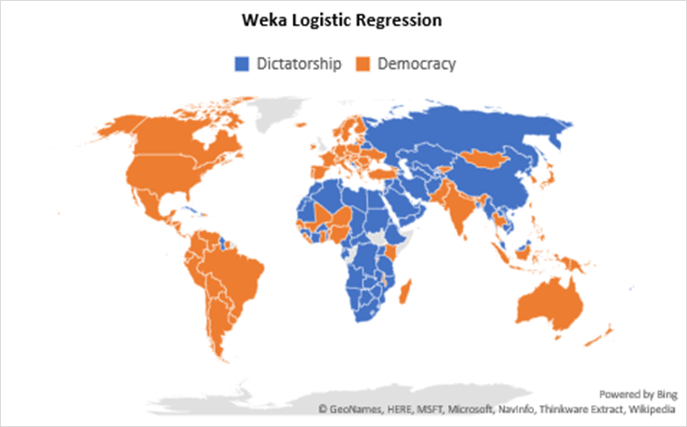

# Module 13: Data Visualization and Utilization

## Introduction

- *“The greatest value of a picture is when it forces us to notice what we never expected to see.”*  
  — John W. Tukey, Author, Mathematician, Statistician

- Data visualization is like a ‘continuous variable’:  
  - Infinite images could express data analysis results.  
  - The challenge: choose the single image that clearly answers the core question of your analytics project.

- This module covers:  
  - Simple approaches to the analysis-visualization-utilization chain.  
  - Using accessible office productivity tools for visualization.  
  - How visualization inspires insight and leads to meaningful decision making.

[“Big Data Analytics Lifecycle” (Erl, Khattak, & Buhler, 2016, p. 54).](images/stage8.png)

### Learning Outcomes

By the end of this module, you should be able to:  
- Outline the process of creating a visualization of analyzed data.  
- Implement office productivity tools and techniques to analyze data and create visualizations.  
- Visually analyze data and clearly articulate findings.  
- Explain how to utilize the results of data analysis.  
- Execute the steps in the data analytics process from data extraction to data utilization.

### Key Terms and Concepts

- **Utilization:**  
  Deciding and acting based on the results of data analysis.

- **Visualization:**  
  Using tools and techniques to graphically present the results of data analysis.

# One Word, or Less

- You’ve learned that people in authority love **sound bites** — brief, sharp slices of your insight to help them decide quickly.

- Your boss exemplifies this preference, expecting you to explain even the most complex breakthroughs —  
  like providing **limitless, renewable, low-cost, environmentally friendly energy** for everything from homes to electronic toothbrushes — in **one word or less**.

- Once, you thought this was impossible — not creating the solution, but **explaining it so briefly**.

- Now you understand the power of convention:  
  > *A picture is worth one thousand words.*  

- To you, a picture’s true value is letting you decide whether to say “Hey” to your boss or just hand them the image with a salute.

- As you head back from your ivory tower to your throne of melted hard drives, you think about module twelve, where you contemplated the **pervasiveness of democratic vs. authoritarian regimes** worldwide.

- You reflected on **exclusive disjunction** — the idea that your life boils down to being assigned to one of two discrete options.

- The concepts of **dichotomous variables** and **political culture** merged as you studied **logistic regression**, a process like this:

---

### Step 1: Raw Data  
*(Source: Wikipedia contributors. (2020, April 7). Democracy-dictatorship index. Wikipedia, The Free Encyclopedia. [Link](https://en.wikipedia.org/w/index.php?title=Democracy-Dictatorship_Index&oldid=949552988))*

### Step 2: Cleaned and Aggregated Data

### Step 3: Transformed Data

### Step 4: Processed Data  
*Using data mining technology*

### Step 5: Analyzed Data  
*At microprocessing speed*

---

- This is a remarkable achievement, but it risks making your boss’s eyes glaze over.

- Unless, by your own wizardry, you use the **de facto spreadsheet visualization tools** to convert terse analytic outputs into data visualization art like this:

## Tips

There is no shortage of resources you can tap for tips on business intelligence and data analytics. Regarding **data visualization** and the **utilization** of analytics results — which, as the previous episode showed, are closely connected — common themes you will encounter include the following:

### The Good
- Visualization can save time (. . . and words . . .) when conveying your ideas to management.
- Visualization facilitates utilization of data analyses by easing the decision-making process through visually highlighting aspects of your business that need attention.
- Visualization can illustrate the results of objective analyses of assumptions (e.g., hypotheses), support their confirmation or rejection, and guide the decisions and actions that follow.

### The Not So Good
- Visualizations of analytical results can unintentionally convey misleading patterns or predictions, which may drive poor decision making.
- Different interpretations or insights, possibly unexpected or unprepared for, may arise from a single visualization.

### The Way of . . .
- **Relevance:** Stay on point in your messaging.
- **Interpretation:** Stay aligned with outputs from your analytical models, which should, in turn, align with the business questions that started the analytics process.
- **Simplicity:** Aim for clarity and avoid distracting with needless details.
- **Insight:** As Mr. Tukey aptly put it, help your audience see what they “never expected to see.”

# Summary (Point Form)

- Data visualization and data utilization correspond to **‘seeing’** and **‘doing’** (or choosing not to do).
- These are the final steps in the Big Data Analytics Lifecycle.
- Visualization and utilization occur throughout the lifecycle, not just at the end.
- At data extraction, you visually inspect data to decide if it can be used next.
- When aggregating data, you inspect it to ensure it’s in the correct format for analytics tools.
- Internal checks during the process are quality control; the final visualization/utilization stage is when data **‘go public’**.
- The goal is to minimize decision makers’ exposure to problems and give a clear view of solutions.
- As a business intelligence and analytics professional, you must ensure data is:
  - Current
  - Reliable
  - Fairly and accurately treated
- You provide a platform for data to tell its story clearly and truthfully.
- This is a significant responsibility that you are now ready to embrace after completing the course.
