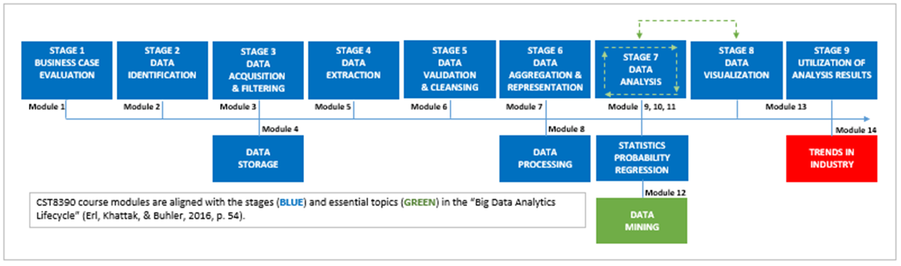

# Module Introduction (Point Form)

- You have now been introduced to the field of **Business Intelligence and Data Analytics (BIDA)**.
- This module explores the **future prospects** and **emerging trends** in the BIDA field.

## Learning Outcomes

By the end of this module, you should be able to:
- Interpret **trends** in the Business Intelligence and Data Analytics field.

## Key Terms and Concepts

- **SQL**: Structured Query Language  
  - An international standard used for **manipulating and querying databases**.

## Trends in Business Intelligence and Data Analytics (BIDA)

### Conceptual Model (Simple Linear Regression)

- Treat **data volume, velocity, and variety** as independent variable `x`.
- Treat the **BIDA field (and its professionals)** as dependent variable `y`.
- Assume:
  - Present-day data characteristics = starting point `a`
  - Growth rate (slope `b`) is **positive**
  - Error term `ε` = variation in `y` not explained by `x`

#### Linear Model:
`y = bx + a + ε`

- If `b > 0`, then as data grows, BIDA grows too.
- Based on industry data, growth in `y` is **"very positive"**.

---

### Indicators of Growth

- Published reports cite over **70+ variables** showing growth:
  - **Job creation**
  - **Demand for services**
  - **Industry adoption**
- BIDA is widely seen as **"on the uptick."**

---

### In-Demand Skills (Ranked by Frequency in Job Postings)

1. **Data Analysis**
   - Critical thinking and pattern recognition
   - Ability to derive actionable insights from data

2. **SQL**
   - Core database querying skill
   - Essential for data analysts, engineers, scientists, and business roles

3. **Data Management**
   - Structuring and maintaining databases
   - Includes data access and storage strategies

4. **Business Intelligence**
   - Gathering and interpreting data to support decisions
   - Roles include BI Developer, Analyst, Customer Insight Analyst

5. **Data Warehousing**
   - Integrating data from multiple sources
   - Enabling analytics through centralized data storage
   - Common role: Data Engineer

---

### Career Guidance

- In-demand skills can help guide:
  - **Training**
  - **Career path decisions**
- Consider your:
  - Interests
  - Abilities
  - Learning style

---

### Recommended Skills for BIDA Careers (Based on Doyle, 2020)

- **Hard Skills**
  - Data tools, analysis, SQL, BI platforms
- **Soft Skills**
  - Communication, adaptability, problem-solving
- **Industry Knowledge**
  - Understanding specific business domains
- **Interpersonal Skills**
  - Collaboration, emotional intelligence

> 📌 See Doyle (2020) for a comprehensive skill breakdown.

---

### Summary

- BIDA is a **core competency** for modern organizations.
- The field will **continue to grow and drive change**.
- Skills learned in this course are:
  - **Transferable** across industries and roles
  - **Beneficial** whether or not you're a full-time analyst
- Understanding **data-driven decision making** is an asset in any career.

